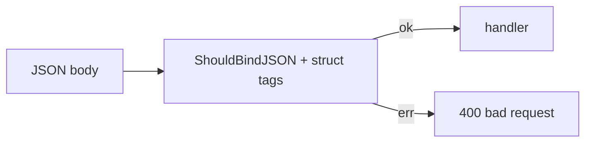

# Module 02 — Binding & Validation

> **Agent**: `@Memory.md` + `@Prompt.md` + this + `@NOTES.md` · ← [01](../01-routing-handlers/MODULE.md) · Next → [03 Middleware](../03-middleware/MODULE.md)

## Visual map
```
type CreateItem struct {
    Name  string `json:"name"  binding:"required,min=1"`
    Price float64 `json:"price" binding:"gt=0"`
}
var in CreateItem
if err := c.ShouldBindJSON(&in); err != nil { c.JSON(400, ...); return }
```

**Mental model**: Struct tags = validation rules (= Zod/Pydantic). `ShouldBind*` non-panicking (you handle err → 400). `MustBind` aborts. go-playground validator powers `binding:`.

**Redraw**: body → bind+tags → handler / 400.

## Objectives
1. Struct tags (json + binding)
2. `ShouldBindJSON/Query/Uri`
3. Validator + custom rules
4. Bind errors → 400

## Topics
- `json:` + `binding:"required,min,email,gt"` tags
- `ShouldBind*` vs `MustBind*`; binding sources (JSON/query/uri/form)
- go-playground validator; custom validators; response structs

## Assignments
| # | Task | Passing criteria |
|---|------|------------------|
| A1 | Bind+validate a request struct | Bad input → clean 400 |
| A2 | Custom validator | Enforces rule, 400 on fail |

## Active recall
1. struct tag binding = ? (analogy)
2. ShouldBind vs MustBind?
3. Validation fail → kaunsa status?

## Checklist
- [ ] Bind flow from memory · [ ] A1,A2 · [ ] NOTES updated
