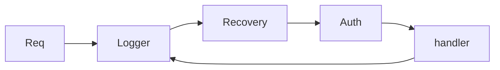

# Module 03 — Middleware

> **Agent**: `@Memory.md` + `@Prompt.md` + this + `@NOTES.md` · ← [02](../02-validation-serialization/MODULE.md) · Next → [04 DB](../04-database-orm/MODULE.md)

## Visual map
```
func RequestID() gin.HandlerFunc {
  return func(c *gin.Context){
    c.Set("rid", uuid())   // request-scoped
    c.Next()               // run downstream
    // (code here runs AFTER handler)
  }
}
r.Use(RequestID())         // global   |  grp.Use(Auth())  // group
c.Abort() / c.AbortWithStatus(401)  // stop chain
```

**Mental model**: Middleware = handler chain; `c.Next()` aage bhejta, `c.Abort()` rokta. `c.Set/Get` = request-scoped values; deep cancellation ke liye `c.Request.Context()`. Order matters (Recovery pehle).

**Redraw**: chain with Next/Abort.

## Objectives
1. `gin.HandlerFunc` middleware
2. `c.Next()` / `c.Abort()`
3. global/group/route scope; `c.Set/Get`
4. `context.Context` access

## Topics
- Middleware funcs; pre/post-handler code; ordering
- `c.Next`, `c.Abort`, `c.AbortWithStatusJSON`
- `c.Set`/`c.Get`; built-ins (Logger, Recovery, CORS)
- `c.Request.Context()` for cancellation

## Assignments
| # | Task | Passing criteria |
|---|------|------------------|
| A1 | Request-id + logging middleware | Each log has rid |
| A2 | Auth-guard middleware (abort 401) | Blocks unauth, allows auth |

## Active recall
1. Next vs Abort?
2. Middleware order kyun matter karta?
3. c.Set vs context.Context?

## Checklist
- [ ] Chain from memory · [ ] A1,A2 · [ ] NOTES updated
