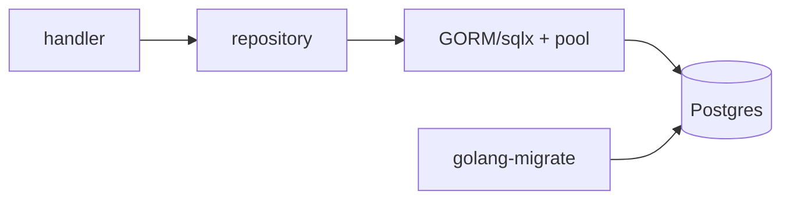

# Module 04 — Database (GORM / sqlx)

> **Agent**: `@Memory.md` + `@Prompt.md` + this + `@NOTES.md` · ← [03](../03-middleware/MODULE.md) · Next → [05 Auth](../05-auth-security/MODULE.md)

## Visual map
```
database/sql (stdlib pool) ── GORM (ORM, auto-migrate, relations)
                           └─ sqlx (explicit SQL, faster, control)
db.WithContext(ctx).Create(&x)        // ctx deadline flows to query
tx := db.Begin(); ...; tx.Rollback()/tx.Commit()
pool: SetMaxOpenConns / SetMaxIdleConns
```

**Mental model**: GORM = convenience (auto-migrate, relations); sqlx = explicit SQL + perf (good for gateway/hot paths). `ctx` har query pe (deadline/cancel). Pool tune karo. Txn = atomic (CV: ledger).

**Redraw**: handler→repo→db(pool)→Postgres.

## Objectives
1. GORM vs sqlx trade-off
2. Connection pool tuning
3. ctx on queries
4. Transactions + migrations

## Topics
- `database/sql` pool; GORM (models, auto-migrate, CRUD, relations)
- sqlx (explicit queries, struct scan); `SetMaxOpenConns`
- `WithContext(ctx)`; txn begin/commit/rollback
- golang-migrate; repository pattern

## Assignments
| # | Task | Passing criteria |
|---|------|------------------|
| A1 | GORM or sqlx CRUD via a repo | Persists + reads |
| A2 | Migration + a rolling-back txn | No partial write |

## Active recall
1. GORM vs sqlx — kab kya?
2. ctx query pe kyun?
3. Pool tune kyun?

## Checklist
- [ ] DB flow from memory · [ ] A1,A2 · [ ] NOTES updated
