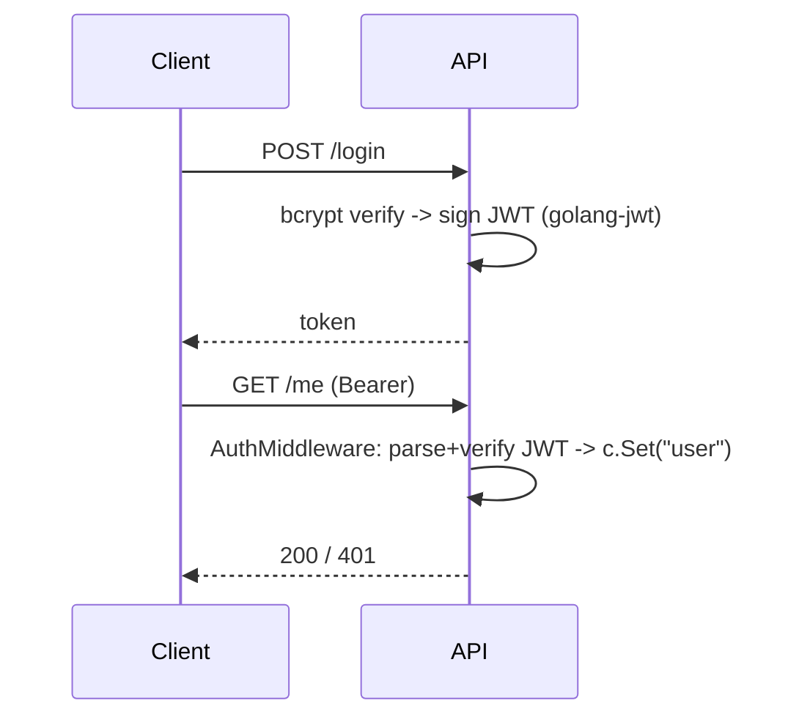

# Module 05 — Auth & Security

> **Agent**: `@Memory.md` + `@Prompt.md` + this + `@NOTES.md` · ← [04](../04-database-orm/MODULE.md) · Next → [06 Goroutines](../06-concurrency-async/MODULE.md)

## Visual map

**Mental model**: Auth = middleware jo Bearer JWT verify karke `c.Set("user")` karta; protected group us middleware ke peeche. bcrypt for passwords. RBAC = role claim check. Rate limit per token (Redis) — gateway critical.

**Redraw**: login→JWT→auth middleware sequence.

## Objectives
1. JWT create/verify (golang-jwt)
2. Auth middleware
3. bcrypt hashing; RBAC
4. Rate limiting

## Topics
- JWT claims/exp/verify; `Authorization: Bearer`
- Auth middleware → `c.Set("user")`; 401/403
- bcrypt; RBAC via context value
- CORS, secure headers; per-token rate limit (Redis)

## Assignments
| # | Task | Passing criteria |
|---|------|------------------|
| A1 | login→JWT→protected group | Valid 200, missing/bad 401 |
| A2 | Role check in middleware | Wrong role 403 |

## Active recall
1. JWT verify kahan (middleware)?
2. bcrypt kyun?
3. RBAC kaise carry hota (context)?

## Checklist
- [ ] Auth seq from memory · [ ] A1,A2 · [ ] NOTES updated
