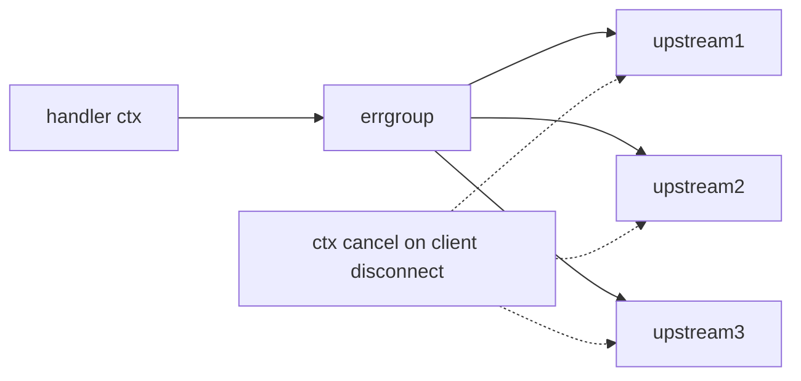

# Module 06 — Goroutines & Channels 🔥

> **Agent**: `@Memory.md` + `@Prompt.md` + this + `@NOTES.md` · ← [05](../05-auth-security/MODULE.md) · Next → [07 Resilience](../07-error-handling-resilience/MODULE.md)

## Visual map
```
go worker(ch)                 // cheap goroutine
ch := make(chan Job, 10)      // buffered = queue
select { case j := <-ch: ...; case <-ctx.Done(): return }  // cancellation

WORKER POOL (CV: Kafka workers):
 jobs[chan] --> g1,g2,g3 --> results[chan]
errgroup: g.Go(func() error{...}); g.Wait()  // fan-out + first-error + ctx cancel
race detector: go test -race   |  leak: goroutine blocked forever on a channel
```

**Mental model**: Goroutines cheap (KBs), millions ok. Channels se communicate (shared var nahi). `context` cancellation client disconnect pe upstream calls abort karta → gateway cost bachta. Leak = goroutine forever blocked. `-race` se data races pakdo.

**Redraw**: worker pool + errgroup fan-out + ctx cancel.

## Objectives
1. goroutines + channels + select
2. worker pool; WaitGroup/Mutex/errgroup
3. context cancellation/deadline
4. goroutine leaks + race detector; singleflight

## Topics
- goroutines; channels (buffered/unbuffered, close, `select`)
- "share memory by communicating"; worker pool
- `sync.WaitGroup`/`Mutex`, `errgroup`
- `context` cancel/deadline propagation; leaks; `-race`; `singleflight` (dedupe — gateway)

## Assignments
| # | Task | Passing criteria |
|---|------|------------------|
| A1 | Fan-out N upstreams via errgroup + ctx timeout | Concurrent, cancels on timeout |
| A2 | Worker pool over a channel | N workers drain jobs |
| A3 | Find + fix a goroutine leak (`-race`/pprof) | No leak, explained |

## Active recall
1. goroutine vs OS thread?
2. unbuffered vs buffered channel?
3. context cancel gateway cost kaise bachata?
4. goroutine leak kaise hota?

## Checklist
- [ ] Worker pool + ctx from memory · [ ] A1–A3 · [ ] NOTES updated
