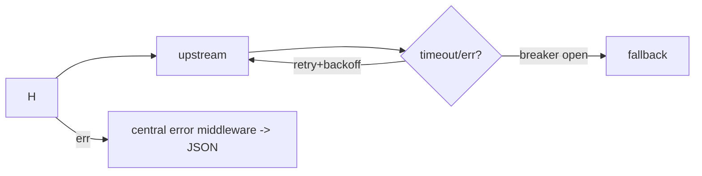

# Module 07 — Error Handling & Resilience

> **Agent**: `@Memory.md` + `@Prompt.md` + this + `@NOTES.md` · ← [06](../06-concurrency-async/MODULE.md) · Next → [08 Testing](../08-testing/MODULE.md)

## Visual map
```
val, err := f()
if err != nil { return fmt.Errorf("f: %w", err) }   // wrap, keep chain
errors.Is(err, ErrNotFound)  /  errors.As(err, &myErr)
panic/recover -> ONLY at boundary (gin Recovery middleware)

upstream: ctx,cancel := context.WithTimeout(...,2s); defer cancel()
retry + backoff; gobreaker (open on failures -> fallback)
http.Server.Shutdown(ctx)  // graceful: stop accepting, drain in-flight
```

**Mental model**: Errors values hain — wrap (`%w`), inspect (`Is/As`). panic sirf boundary pe. Har upstream call: ctx timeout + retry + breaker (CV: provider fallback). Graceful shutdown = in-flight drain.

**Redraw**: error wrap chain + timeout/retry/breaker + graceful shutdown.

## Objectives
1. error wrapping, `Is/As`, sentinels
2. panic/recover boundary
3. timeouts, retries, circuit breaker
4. graceful shutdown

## Topics
- `fmt.Errorf("%w")`; `errors.Is/As`; sentinel errors
- panic/recover at gin Recovery boundary; `c.Error` + central error middleware
- `context.WithTimeout`; `http.Client` timeout; retry+backoff; gobreaker
- `http.Server.Shutdown(ctx)` graceful

## Assignments
| # | Task | Passing criteria |
|---|------|------------------|
| A1 | Error-wrapping chain + central error middleware | Consistent JSON errors |
| A2 | Upstream with ctx timeout + retry + breaker | Times out, retries, opens breaker |

## Active recall
1. `%w` wrapping kyun?
2. panic/recover kab use?
3. graceful shutdown kya karta?

## Checklist
- [ ] Resilience from memory · [ ] A1,A2 · [ ] NOTES updated
