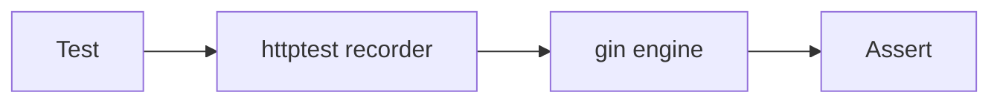

# Module 08 — Testing

> **Agent**: `@Memory.md` + `@Prompt.md` + this + `@NOTES.md` · ← [07](../07-error-handling-resilience/MODULE.md) · Next → [09 Observability](../09-observability/MODULE.md)

## Visual map
```
table-driven:
  cases := []struct{ name string; in X; want Y }{ ... }
  for _, c := range cases { t.Run(c.name, func(t *testing.T){ ... }) }
httptest:
  w := httptest.NewRecorder(); req := httptest.NewRequest(...); engine.ServeHTTP(w, req)
mock: small repo interface -> swap with a fake in tests
go test -race ./...
```

**Mental model**: Table-driven tests = Go idiom (cases array). `httptest` se gin handlers bina real server test. Small interfaces se mocking aasan (CV: repo interface). `-race` CI mein.

**Redraw**: httptest recorder → engine → assert.

## Objectives
1. table-driven tests
2. `httptest` for handlers
3. interface mocking
4. `-race`, benchmarks

## Topics
- `testing`; subtests `t.Run`; table-driven cases
- `net/http/httptest` (Recorder, Request); testify asserts
- mock via small interfaces; test DB
- `go test -race`; `Benchmark*`

## Assignments
| # | Task | Passing criteria |
|---|------|------------------|
| A1 | Table-driven handler test (httptest) | Multiple cases pass |
| A2 | Mock a repo interface | Handler tested without DB |

## Active recall
1. table-driven test kya?
2. httptest se handler kaise test?
3. interfaces mocking kaise help karti?

## Checklist
- [ ] httptest flow from memory · [ ] A1,A2 · [ ] NOTES updated
