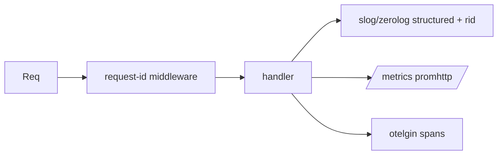

# Module 09 — Observability

> **Agent**: `@Memory.md` + `@Prompt.md` + this + `@NOTES.md` · ← [08](../08-testing/MODULE.md) · Next → [10 Deploy](../10-deploy-capstone/MODULE.md)

## Visual map

```
slog.Info("req", "rid", rid, "latency_ms", ms)   // structured
promhttp.Handler() at /metrics ; custom counters (RED)
otelgin.Middleware() -> spans + propagation ; pprof for profiling
```
**Mental model**: slog/zerolog = structured logs + request-id. otelgin = auto spans. promhttp = metrics (RED). pprof = CPU/mem profiling (gateway perf). Per-request latency/cost log karo (CV: Prometheus).

**Redraw**: req-id + 3 pillars (logs/metrics/traces).

## Objectives
1. structured logging + request-id
2. OTEL (otelgin)
3. Prometheus (promhttp)
4. pprof; health/readiness

## Topics
- slog/zerolog; request-id middleware
- otelgin spans + context propagation
- promhttp `/metrics`; custom RED metrics
- pprof; `/health` `/ready`; per-request latency/cost

## Assignments
| # | Task | Passing criteria |
|---|------|------------------|
| A1 | slog structured logs + request-id | Each log carries rid |
| A2 | `/metrics` + counter + otelgin spans | Metrics + traces emitted |

## Active recall
1. metrics vs logs vs traces?
2. pprof kab use?
3. request-id propagate kyun?

## Checklist
- [ ] 3 pillars from memory · [ ] A1,A2 · [ ] NOTES updated
