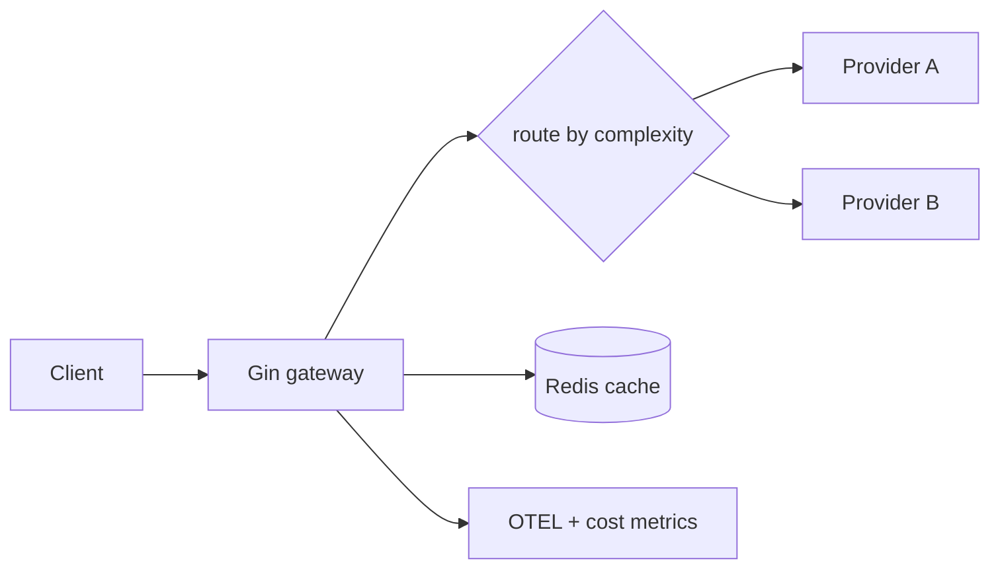

# Module 10 — Deploy & Capstone 🔥 (LLM Gateway)

> **Agent**: `@Memory.md` + `@Prompt.md` + this + `@NOTES.md` · ← [09](../09-observability/MODULE.md)

## Visual map
```
go build -> single static binary -> FROM scratch/distroless (tiny image)
CAPSTONE — LLM Gateway:
  client -> [gin] -> route by complexity (Haiku/Sonnet/Opus)
                  -> Redis semantic cache (hit? return)
                  -> rate limit + per-user budget
                  -> circuit breaker + provider fallback
                  -> SSE passthrough + OTEL trace + cost meter
```

**Mental model**: Go static binary → scratch image (MBs). Capstone = tumhara **Project C** — sab modules ek high-throughput gateway mein. CV bullet: routing + semantic cache se ~40% cost cut, p99 tracked.

**Redraw**: gateway flow (route→cache→breaker→provider).

## Objectives
1. static binary + tiny Docker
2. graceful shutdown in container
3. perf (GOMAXPROCS, conn reuse, pprof)
4. Capstone: LLM Gateway

## Topics
- `go build` static; multi-stage → scratch/distroless; env config
- graceful shutdown; GOMAXPROCS; HTTP connection reuse; pprof
- **Capstone**: gateway with model routing + Redis semantic cache + rate limit/budget + breaker/fallback + OTEL + SSE

## Assignments
| # | Task | Passing criteria |
|---|------|------------------|
| A1 | Multi-stage scratch Docker + graceful shutdown | Tiny image, drains in-flight |
| A2 | Capstone gateway subset (routing + cache + breaker + metrics) | Works, measured cost/latency |

## Active recall
1. scratch image kyun chhoti?
2. graceful shutdown kya drain karta?
3. gateway cost kaise kam (cache+routing)?

## Checklist
- [ ] Gateway flow from memory · [ ] A1,A2 · [ ] **Go spaced-rep checklist** full pass · [ ] NOTES updated
