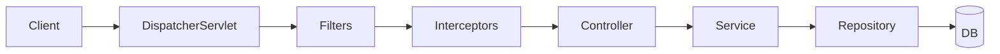

# Java (Spring Boot) — Home

> Backend framework vault. ← [[Backend/README|Backend Index]] · use case: enterprise + MAANG interviews

## Quick links
| Doc | Kya hai |
|-----|---------|
| [[Backend/Java-SpringBoot/Memory\|Memory]] | Coach rules, profile, CV→Spring hooks |
| [[Backend/Java-SpringBoot/Prompt\|Prompt]] | Hinglish coach persona |
| [[Backend/Java-SpringBoot/LEARNING-PLAN\|LEARNING-PLAN]] | **Full syllabus** |
| [[Backend/Java-SpringBoot/VISUAL-STUDY-GUIDE\|VISUAL-STUDY-GUIDE]] | IoC + layered arch + spaced-rep |

## Why Spring Boot for you
MAANG/enterprise backend ka de-facto — **highest interview surface area** (India + global). IoC/DI container, Spring Data JPA, Spring Security, mature ecosystem. Bade systems + interview rounds dono ke liye.

## Modules
| # | Module | Notes | Focus |
|---|--------|-------|-------|
| 00 | [[Backend/Java-SpringBoot/modules/00-foundations/MODULE\|Foundations]] | [[Backend/Java-SpringBoot/modules/00-foundations/NOTES\|NOTES]] | IoC/DI, beans, Maven/Gradle |
| 01 | [[Backend/Java-SpringBoot/modules/01-routing-handlers/MODULE\|Controllers & REST]] | [[Backend/Java-SpringBoot/modules/01-routing-handlers/NOTES\|NOTES]] | @RestController, mappings |
| 02 | [[Backend/Java-SpringBoot/modules/02-validation-serialization/MODULE\|DTOs & Validation]] | [[Backend/Java-SpringBoot/modules/02-validation-serialization/NOTES\|NOTES]] | Bean Validation, Jackson |
| 03 | [[Backend/Java-SpringBoot/modules/03-middleware/MODULE\|Filters & Interceptors]] | [[Backend/Java-SpringBoot/modules/03-middleware/NOTES\|NOTES]] | filters, interceptors, AOP |
| 04 | [[Backend/Java-SpringBoot/modules/04-database-orm/MODULE\|Spring Data JPA]] | [[Backend/Java-SpringBoot/modules/04-database-orm/NOTES\|NOTES]] | JPA/Hibernate, repos |
| 05 | [[Backend/Java-SpringBoot/modules/05-auth-security/MODULE\|Spring Security]] | [[Backend/Java-SpringBoot/modules/05-auth-security/NOTES\|NOTES]] | filter chain, JWT |
| 06 | [[Backend/Java-SpringBoot/modules/06-concurrency-async/MODULE\|Concurrency & Async]] 🔥 | [[Backend/Java-SpringBoot/modules/06-concurrency-async/NOTES\|NOTES]] | threads, @Async, virtual threads, WebFlux |
| 07 | [[Backend/Java-SpringBoot/modules/07-error-handling-resilience/MODULE\|Errors & Resilience]] | [[Backend/Java-SpringBoot/modules/07-error-handling-resilience/NOTES\|NOTES]] | @ControllerAdvice, resilience4j |
| 08 | [[Backend/Java-SpringBoot/modules/08-testing/MODULE\|Testing]] | [[Backend/Java-SpringBoot/modules/08-testing/NOTES\|NOTES]] | JUnit, MockMvc, Mockito |
| 09 | [[Backend/Java-SpringBoot/modules/09-observability/MODULE\|Observability]] | [[Backend/Java-SpringBoot/modules/09-observability/NOTES\|NOTES]] | Actuator, Micrometer, OTEL |
| 10 | [[Backend/Java-SpringBoot/modules/10-deploy-capstone/MODULE\|Deploy & Capstone]] 🔥 | [[Backend/Java-SpringBoot/modules/10-deploy-capstone/NOTES\|NOTES]] | Docker, JAR, ship service |

## Request flow (mental model)


## Vault path
```
/Users/vansh/Desktop/Code/Learning/Backend/Java-SpringBoot
```
