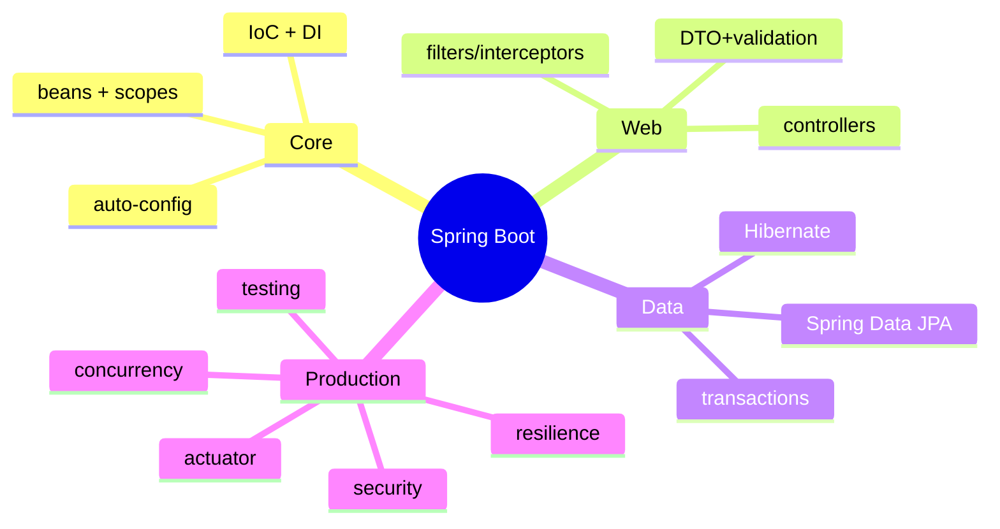

# Java (Spring Boot) — Learning Plan (Full Syllabus)

> Visual learner: har module `## Visual map`. Start: `@VISUAL-STUDY-GUIDE.md`. No standard topic left out.

## Mind map

---

## Module 00 — Foundations
**Topics**: JVM/JDK; Maven/Gradle + starters; **IoC container + Dependency Injection** (the heart); beans, `@Component`/`@Service`/`@Repository`/`@Configuration`/`@Bean`; **constructor injection** (preferred) vs field; bean scopes (singleton/prototype/request); component scanning; auto-configuration; `application.yml`/profiles; `@SpringBootApplication`.
**Assignments**: A1 a service bean injected into another via constructor; A2 two profiles + a `@ConfigurationProperties` bean.
**Exit**: IoC/DI (container creates+injects); bean scopes; auto-config; constructor vs field injection.

## Module 01 — Controllers & REST
**Topics**: `@RestController`; `@GetMapping`/`@PostMapping`/...; `@PathVariable`, `@RequestParam`, `@RequestBody`; `ResponseEntity` + status; `@RequestMapping` base path; content negotiation; DispatcherServlet flow.
**Assignments**: A1 CRUD controller with `ResponseEntity`; A2 path + query + body params.
**Exit**: mapping annotations; @RequestBody vs @RequestParam vs @PathVariable; DispatcherServlet role.

## Module 02 — DTOs & Validation
**Topics**: DTOs vs entities (don't expose entities!); Jackson (de)serialization (`@JsonProperty`, `@JsonIgnore`); **Bean Validation** (`@Valid`, `@NotNull`/`@Size`/`@Email`/`@Min`); validation errors → 400 (handled in module 07); mapping DTO↔entity (MapStruct option); records as DTOs.
**Assignments**: A1 request/response DTOs + `@Valid`; A2 custom validator annotation.
**Exit**: DTO vs entity (why separate); `@Valid` flow; Jackson basics.

## Module 03 — Filters, Interceptors & AOP
**Topics**: Servlet **Filters** (lowest level) vs Spring **HandlerInterceptor** (pre/post handler) vs **AOP** `@Aspect` (method-level cross-cutting); ordering; request-id filter; logging interceptor; `@Around` advice; when to use which; CORS config.
**Assignments**: A1 request-id filter + logging interceptor; A2 an `@Aspect` that logs method timing.
**Exit**: Filter vs Interceptor vs AOP — kab kaunsa; ordering.

## Module 04 — Spring Data JPA
**Topics**: JPA/Hibernate; `@Entity`, `@Id`, relationships (`@OneToMany`/`@ManyToOne`, fetch types); `JpaRepository` (derived queries, `@Query`, pagination/sorting); **`@Transactional`** (propagation, rollback rules, the proxy/self-invocation pitfall); **N+1 problem** + fetch joins/`@EntityGraph`; HikariCP connection pool; Flyway/Liquibase migrations; lazy vs eager.
**Assignments**: A1 entity + `JpaRepository` + derived + `@Query`; A2 a `@Transactional` service that rolls back; A3 reproduce + fix N+1.
**Exit**: JpaRepository; `@Transactional` propagation + self-invocation pitfall; N+1 fix; lazy vs eager.

## Module 05 — Spring Security
**Topics**: the **security filter chain**; `SecurityFilterChain` bean (Spring Security 6 config); authentication vs authorization; `UserDetailsService`; password encoding (BCrypt); **JWT** filter (custom `OncePerRequestFilter`); method security (`@PreAuthorize`); roles/authorities; CSRF (when to disable for stateless APIs); CORS.
**Assignments**: A1 JWT login + a JWT filter securing endpoints; A2 `@PreAuthorize` role check.
**Exit**: filter chain; authN vs authZ; JWT filter; BCrypt; @PreAuthorize.

## Module 06 — Concurrency & Async 🔥
**Topics**: thread-per-request model (Tomcat thread pool); `@Async` + `CompletableFuture` (fan-out); thread pool config (`ThreadPoolTaskExecutor`); **Java 21 virtual threads** (huge for I/O-bound — `spring.threads.virtual.enabled`); thread-safety (immutability, `synchronized`, `java.util.concurrent`); blocking vs reactive; **WebFlux** (reactive, Mono/Flux — when to use vs MVC); `@Scheduled`.
**Assignments**: A1 `@Async` + `CompletableFuture.allOf` fan-out; A2 enable virtual threads + reason about the difference.
**Exit**: thread-per-request; @Async + CompletableFuture; virtual threads (why they change I/O scaling); MVC vs WebFlux.

## Module 07 — Error Handling & Resilience
**Topics**: `@ControllerAdvice` + `@ExceptionHandler` (global error handling); consistent error response (`ProblemDetail`/RFC 7807); validation error mapping; **resilience4j** (circuit breaker, retry, rate limiter, bulkhead, timelimiter — annotations); graceful shutdown; idempotency.
**Assignments**: A1 `@ControllerAdvice` with consistent error envelope; A2 resilience4j `@CircuitBreaker` + `@Retry` on an upstream call.
**Exit**: @ControllerAdvice; ProblemDetail; resilience4j breaker/retry; graceful shutdown.

## Module 08 — Testing
**Topics**: JUnit 5; **Mockito** (`@Mock`, `@InjectMocks`, stubbing); `@WebMvcTest` + **MockMvc** (controller slice tests); `@DataJpaTest` (repo tests); `@SpringBootTest` (integration); **Testcontainers** (real Postgres in tests); assertions (AssertJ).
**Assignments**: A1 service unit test with Mockito; A2 controller test with MockMvc (200 + validation 400).
**Exit**: Mockito mocking; MockMvc slice test; @DataJpaTest; Testcontainers idea.

## Module 09 — Observability
**Topics**: **Spring Boot Actuator** (`/health`, `/metrics`, `/info`); **Micrometer** (metrics facade → Prometheus); custom metrics (`@Timed`, counters); structured logging (Logback + MDC for request-id); OTEL (Micrometer Tracing); health groups (liveness/readiness).
**Assignments**: A1 Actuator + Prometheus metrics + a custom counter; A2 MDC request-id in logs.
**Exit**: Actuator endpoints; Micrometer → Prometheus; MDC logging; liveness vs readiness.

## Module 10 — Deploy & Capstone 🔥
**Topics**: build a fat JAR (`mvn package`); Dockerfile (multi-stage, JRE slim, or buildpacks/jib); layered jars for caching; env config + profiles; JVM tuning basics (heap, GC); graceful shutdown; **Capstone**: ship a real service (suggest: an order/payment API or a task/workflow service) — controllers + DTOs + JPA + security + transactions + resilience + Actuator + tests + Docker.
**Assignments**: A1 multi-stage Docker for the JAR; A2 capstone service touching all modules.
**Exit**: fat JAR + Docker; profiles; a defendable enterprise-style service.

---

## Weekly rhythm
Mon–Tue concept+recall (demystify magic) · Wed–Thu build · Fri JPA/security/resilience + NOTES · Sat spaced recall · Sun capstone.

## Spaced repetition checklist (har 2 modules)
- [ ] IoC/DI + bean scopes
- [ ] @Transactional propagation + self-invocation pitfall
- [ ] N+1 problem + fix
- [ ] security filter chain + JWT
- [ ] @Async / virtual threads
- [ ] @ControllerAdvice error handling
- [ ] MockMvc vs @DataJpaTest vs @SpringBootTest
