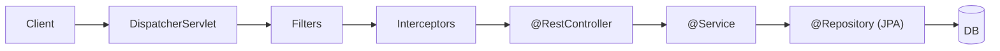

# Java (Spring Boot) Visual Study Guide — Vansh

> Diagrams pehle, redraw se recall.

## Layered architecture + request flow (MEMORIZE)

```
Controller = HTTP boundary (DTOs)
Service    = business logic (@Transactional here)
Repository = data access (Spring Data JPA)
```

## IoC / DI (the magic, demystified)
```
You write:  @Service class OrderService { OrderService(PaymentClient p){...} }
Spring does: scans @Service -> creates the bean -> sees ctor needs PaymentClient
             -> finds/creates that bean -> INJECTS it. You never call `new`.
Bean scopes: singleton (default, one shared) | prototype | request
~ Dependency Injection from your LLD work, but the CONTAINER wires it.
```

## @Transactional pitfall (top interview Q)
```
@Transactional works via a PROXY around the bean.
SELF-INVOCATION TRAP: calling this.txMethod() from another method in the SAME class
   bypasses the proxy => no transaction!  Fix: call via the injected bean / separate class.
Propagation: REQUIRED (default), REQUIRES_NEW, ... ; rollback on RuntimeException by default.
```

## N+1 problem
```
findAll() returns 100 orders -> then lazy-loads items per order = 1 + 100 queries (N+1)
FIX: JOIN FETCH / @EntityGraph / batch fetching
```

## Concurrency: thread-per-request -> virtual threads
```
classic: 1 OS thread per request (Tomcat pool, ~200) -> blocks on I/O = limited
Java 21 virtual threads: millions of cheap threads -> blocking I/O scales (enable in Spring)
WebFlux (reactive Mono/Flux): non-blocking, steeper curve -> use for very high concurrency
```

## CV/LLD ↔ Spring bridge
```
DI (your LLD)        -> IoC container + @Autowired
layered services     -> @Controller/@Service/@Repository
DB transactions      -> @Transactional
Kafka                -> @KafkaListener
Prometheus           -> Micrometer + Actuator
circuit breaker      -> resilience4j @CircuitBreaker
```

## Spaced-rep recall bank
1. IoC/DI — container kya karta?
2. @Transactional self-invocation trap?
3. N+1 + fix?
4. security filter chain?
5. virtual threads kya badalte?
6. bean scopes?
