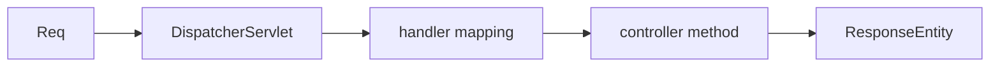

# Module 01 — Controllers & REST

> **Agent**: `@Memory.md` + `@Prompt.md` + this + `@NOTES.md` · ← [00](../00-foundations/MODULE.md) · Next → [02 DTOs](../02-validation-serialization/MODULE.md)

## Visual map
```
@RestController @RequestMapping("/api/items")
class ItemController {
  @GetMapping("/{id}") ResponseEntity<ItemDto> get(@PathVariable Long id){...}
  @PostMapping ResponseEntity<ItemDto> create(@RequestBody ItemReq body){...}
}
@PathVariable (path) | @RequestParam (query) | @RequestBody (JSON)
```

**Mental model**: `@RestController` = REST endpoints; DispatcherServlet request ko sahi method pe route karta. `ResponseEntity` = body + status + headers control. PathVariable/RequestParam/RequestBody = request parts.

**Redraw**: DispatcherServlet → mapping → controller.

## Objectives
1. `@RestController` + mappings
2. PathVariable/RequestParam/RequestBody
3. `ResponseEntity` + status
4. DispatcherServlet flow

## Topics
- `@GetMapping`/`@PostMapping`/...; `@RequestMapping` base
- `@PathVariable`, `@RequestParam`, `@RequestBody`
- `ResponseEntity`; status codes; content negotiation
- DispatcherServlet role

## Assignments
| # | Task | Passing criteria |
|---|------|------------------|
| A1 | CRUD controller with ResponseEntity | All verbs + correct status |
| A2 | path + query + body params | All bound |

## Active recall
1. @RequestBody vs @RequestParam vs @PathVariable?
2. ResponseEntity kya control deta?
3. DispatcherServlet ka role?

## Checklist
- [ ] Request flow from memory · [ ] A1,A2 · [ ] NOTES updated
