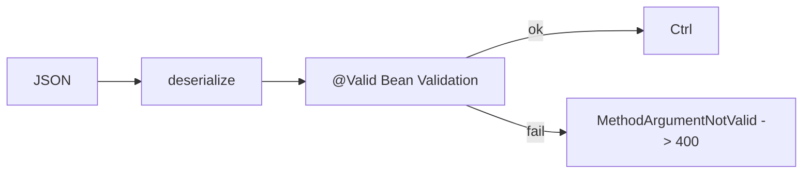

# Module 02 — DTOs & Validation

> **Agent**: `@Memory.md` + `@Prompt.md` + this + `@NOTES.md` · ← [01](../01-routing-handlers/MODULE.md) · Next → [03 Filters](../03-middleware/MODULE.md)

## Visual map
```
record ItemReq(@NotBlank String name, @Min(1) double price) {}   // DTO (not entity!)
@PostMapping create(@Valid @RequestBody ItemReq body){...}        // @Valid triggers validation
Jackson: JSON <-> object  (@JsonProperty, @JsonIgnore)
Entity (DB) ──map──> DTO (API)   // never expose entities directly
```

**Mental model**: DTO = API contract (entity se alag — security + decoupling). `@Valid` + Bean Validation annotations rules enforce karte; fail → 400 (handle in module 07). Jackson JSON↔object. Records = concise DTOs.

**Redraw**: JSON → Jackson → @Valid → controller / 400.

## Objectives
1. DTO vs entity (why separate)
2. Bean Validation (`@Valid`)
3. Jackson basics
4. DTO↔entity mapping

## Topics
- DTOs vs entities; records as DTOs
- Jackson (`@JsonProperty`, `@JsonIgnore`)
- Bean Validation (`@NotNull`/`@Size`/`@Email`/`@Min`); `@Valid`; custom validator
- mapping (MapStruct option)

## Assignments
| # | Task | Passing criteria |
|---|------|------------------|
| A1 | Request/response DTOs + `@Valid` | Bad input → 400 |
| A2 | Custom validator annotation | Enforces rule |

## Active recall
1. DTO vs entity alag kyun?
2. `@Valid` kya trigger karta?
3. Jackson kya karta?

## Checklist
- [ ] DTO/validation from memory · [ ] A1,A2 · [ ] NOTES updated
