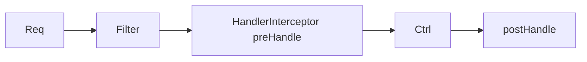

# Module 03 — Filters, Interceptors & AOP

> **Agent**: `@Memory.md` + `@Prompt.md` + this + `@NOTES.md` · ← [02](../02-validation-serialization/MODULE.md) · Next → [04 JPA](../04-database-orm/MODULE.md)

## Visual map
```
Filter (servlet level)  -> Interceptor (Spring, pre/postHandle) -> Controller
AOP @Aspect @Around: wrap ANY bean method (logging, timing, txn-like)

req --> [Filter: request-id] --> [Interceptor: auth/log] --> Controller --> [Interceptor postHandle]
```

**Mental model**: 3 levels of cross-cutting — **Filter** (lowest, servlet, all requests), **Interceptor** (Spring MVC, handler-aware pre/post), **AOP** (method-level on any bean). Filter for raw/request-id, Interceptor for handler concerns, AOP for business cross-cutting.

**Redraw**: Filter → Interceptor → Controller chain.

## Objectives
1. Filter vs Interceptor vs AOP
2. ordering
3. request-id + logging
4. `@Around` advice

## Topics
- Servlet `Filter`; `HandlerInterceptor` (preHandle/postHandle); AOP `@Aspect`/`@Around`
- ordering; when to use which
- request-id filter; logging interceptor; CORS config

## Assignments
| # | Task | Passing criteria |
|---|------|------------------|
| A1 | request-id filter + logging interceptor | rid present, logs each req |
| A2 | `@Aspect` logging method timing | Times target methods |

## Active recall
1. Filter vs Interceptor vs AOP — kab kya?
2. preHandle vs postHandle?
3. AOP method-level kaise hook karta?

## Checklist
- [ ] 3-level chain from memory · [ ] A1,A2 · [ ] NOTES updated
