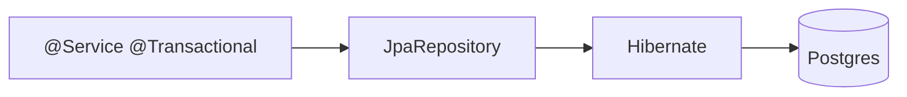

# Module 04 — Spring Data JPA

> **Agent**: `@Memory.md` + `@Prompt.md` + this + `@NOTES.md` · ← [03](../03-middleware/MODULE.md) · Next → [05 Security](../05-auth-security/MODULE.md)

## Visual map
```
@Entity class Order { @Id Long id; @OneToMany List<Item> items; }
interface OrderRepo extends JpaRepository<Order,Long> {
   List<Order> findByStatus(String s);  // derived query
}
@Transactional service method  -> PROXY -> begin/commit/rollback
N+1: findAll() then lazy items per row -> JOIN FETCH / @EntityGraph
```

**Mental model**: Spring Data JPA = repository interfaces (method-name → query auto). `@Transactional` proxy se atomic. **N+1** + **self-invocation** sabse common interview traps. HikariCP = pool.

**Redraw**: service→repo→Hibernate→DB + @Transactional proxy.

## Objectives
1. `@Entity` + relationships + `JpaRepository`
2. `@Transactional` (propagation, self-invocation pitfall)
3. N+1 + fix
4. pooling; migrations; lazy/eager

## Topics
- `@Entity`/`@Id`/relationships (fetch types); `JpaRepository` derived + `@Query` + pagination
- `@Transactional` propagation, rollback rules, proxy self-invocation pitfall
- N+1 + JOIN FETCH/`@EntityGraph`; HikariCP; Flyway/Liquibase; lazy vs eager

## Assignments
| # | Task | Passing criteria |
|---|------|------------------|
| A1 | Entity + JpaRepository + derived + `@Query` | Queries work |
| A2 | `@Transactional` service rolls back | No partial write |
| A3 | Reproduce + fix N+1 | Query count drops |

## Active recall
1. `@Transactional` self-invocation pitfall?
2. N+1 kya, fix?
3. lazy vs eager?

## Checklist
- [ ] JPA flow + traps from memory · [ ] A1–A3 · [ ] NOTES updated
