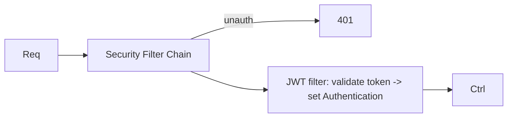

# Module 05 — Spring Security

> **Agent**: `@Memory.md` + `@Prompt.md` + this + `@NOTES.md` · ← [04](../04-database-orm/MODULE.md) · Next → [06 Concurrency](../06-concurrency-async/MODULE.md)

## Visual map

```
@Bean SecurityFilterChain: stateless, permit /login, authenticate rest
JWT: custom OncePerRequestFilter -> decode -> SecurityContext.setAuthentication
BCryptPasswordEncoder; @PreAuthorize("hasRole('ADMIN')") method security
authN (who) vs authZ (allowed?)
```
**Mental model**: Security = ek **filter chain** har request ke aage. Stateless JWT API ke liye: custom JWT filter token verify karke `Authentication` set karta; baaki chain authorize karti. BCrypt for passwords. `@PreAuthorize` method-level.

**Redraw**: security filter chain + JWT filter.

## Objectives
1. security filter chain (SB6 config)
2. authN vs authZ; `UserDetailsService`
3. JWT filter; BCrypt
4. `@PreAuthorize`; CSRF/CORS

## Topics
- `SecurityFilterChain` bean; stateless config
- authentication vs authorization; `UserDetailsService`; BCrypt
- custom JWT `OncePerRequestFilter`; SecurityContext
- `@PreAuthorize`; roles/authorities; CSRF (disable for stateless); CORS

## Assignments
| # | Task | Passing criteria |
|---|------|------------------|
| A1 | JWT login + filter securing endpoints | Valid 200, missing 401 |
| A2 | `@PreAuthorize` role check | Wrong role 403 |

## Active recall
1. security filter chain kya?
2. authN vs authZ?
3. JWT filter SecurityContext mein kya set karta?

## Checklist
- [ ] Filter chain from memory · [ ] A1,A2 · [ ] NOTES updated
