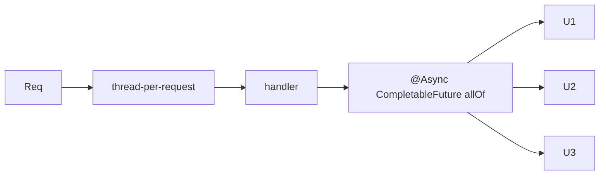

# Module 06 — Concurrency & Async 🔥

> **Agent**: `@Memory.md` + `@Prompt.md` + this + `@NOTES.md` · ← [05](../05-auth-security/MODULE.md) · Next → [07 Resilience](../07-error-handling-resilience/MODULE.md)

## Visual map
```
classic: 1 OS thread / request (Tomcat pool ~200) -> blocks on I/O = capped
@Async + CompletableFuture.allOf(f1,f2,f3) -> fan-out parallel
Java 21 VIRTUAL THREADS: millions cheap threads -> blocking I/O scales hugely
   spring.threads.virtual.enabled=true
WebFlux (Mono/Flux): non-blocking reactive -> very high concurrency, steeper curve
```

**Mental model**: Default = thread-per-request (blocks on I/O). `@Async`+CompletableFuture = parallel fan-out. **Virtual threads (Java 21)** = I/O-bound scaling without going reactive (huge). WebFlux = reactive for extreme concurrency. Thread-safety: immutability + `java.util.concurrent`.

**Redraw**: thread-per-request + @Async fan-out + virtual-thread note.

## Objectives
1. thread-per-request model
2. `@Async` + CompletableFuture
3. virtual threads (Java 21)
4. MVC vs WebFlux; thread-safety

## Topics
- Tomcat thread pool; `@Async` + `CompletableFuture.allOf`; `ThreadPoolTaskExecutor`
- virtual threads (`spring.threads.virtual.enabled`) — why I/O scaling changes
- thread-safety (immutability, `synchronized`, `j.u.concurrent`)
- WebFlux (Mono/Flux) — when over MVC; `@Scheduled`

## Assignments
| # | Task | Passing criteria |
|---|------|------------------|
| A1 | `@Async` + `CompletableFuture.allOf` fan-out | Concurrent, faster |
| A2 | Enable virtual threads + reason the difference | Explained correctly |

## Active recall
1. thread-per-request limitation?
2. virtual threads kya badalte?
3. MVC vs WebFlux — kab?

## Checklist
- [ ] Concurrency models from memory · [ ] A1,A2 · [ ] NOTES updated
