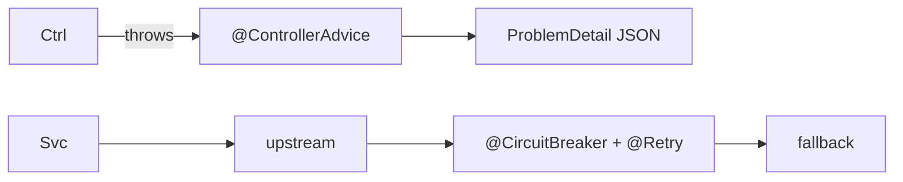

# Module 07 — Error Handling & Resilience

> **Agent**: `@Memory.md` + `@Prompt.md` + this + `@NOTES.md` · ← [06](../06-concurrency-async/MODULE.md) · Next → [08 Testing](../08-testing/MODULE.md)

## Visual map
```
@RestControllerAdvice
class GlobalHandler {
  @ExceptionHandler(NotFoundException.class)
  ProblemDetail handle(...) { return ProblemDetail.forStatus(404); }  // RFC 7807
}
resilience4j: @CircuitBreaker @Retry @RateLimiter @Bulkhead on upstream calls
```

**Mental model**: Global errors via `@ControllerAdvice` + `@ExceptionHandler` → consistent `ProblemDetail`. Upstream calls wrap with **resilience4j** (breaker/retry/ratelimiter/bulkhead — annotation-driven, CV: fallback). Graceful shutdown.

**Redraw**: @ControllerAdvice → ProblemDetail + resilience4j.

## Objectives
1. `@ControllerAdvice` + `@ExceptionHandler`
2. consistent error (ProblemDetail)
3. resilience4j
4. graceful shutdown

## Topics
- `@RestControllerAdvice`; `@ExceptionHandler`; validation error mapping
- `ProblemDetail` (RFC 7807) envelope
- resilience4j: `@CircuitBreaker`/`@Retry`/`@RateLimiter`/`@Bulkhead`/`@TimeLimiter`
- graceful shutdown; idempotency

## Assignments
| # | Task | Passing criteria |
|---|------|------------------|
| A1 | `@ControllerAdvice` consistent error envelope | All errors same shape |
| A2 | resilience4j `@CircuitBreaker` + `@Retry` | Breaker opens, retries |

## Active recall
1. `@ControllerAdvice` kya karta?
2. ProblemDetail kya?
3. resilience4j breaker kab open hota?

## Checklist
- [ ] Error+resilience from memory · [ ] A1,A2 · [ ] NOTES updated
