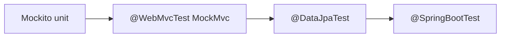

# Module 08 — Testing

> **Agent**: `@Memory.md` + `@Prompt.md` + this + `@NOTES.md` · ← [07](../07-error-handling-resilience/MODULE.md) · Next → [09 Observability](../09-observability/MODULE.md)

## Visual map
```
unit:        @Mock repo; @InjectMocks service; when(...).thenReturn(...)   // Mockito
controller:  @WebMvcTest + MockMvc.perform(get("/x")).andExpect(status().isOk())
repo:        @DataJpaTest (in-memory or Testcontainers)
integration: @SpringBootTest (full context)
real DB:     Testcontainers (Postgres in Docker)
```

**Mental model**: Test pyramid — Mockito unit (fast, isolate service), MockMvc slice (controller without full app), @DataJpaTest (repo), @SpringBootTest (integration), Testcontainers (real Postgres). Pick the lightest that proves it.

**Redraw**: test pyramid (unit→slice→integration).

## Objectives
1. Mockito unit tests
2. MockMvc controller slice
3. `@DataJpaTest`
4. Testcontainers

## Topics
- JUnit 5; Mockito (`@Mock`/`@InjectMocks`/stubbing)
- `@WebMvcTest` + MockMvc; `@DataJpaTest`; `@SpringBootTest`
- Testcontainers (real Postgres); AssertJ

## Assignments
| # | Task | Passing criteria |
|---|------|------------------|
| A1 | Service unit test with Mockito | Repo mocked, logic verified |
| A2 | Controller test (MockMvc): 200 + validation 400 | Both paths asserted |

## Active recall
1. Mockito kya isolate karta?
2. @WebMvcTest vs @SpringBootTest?
3. Testcontainers kyun?

## Checklist
- [ ] Test pyramid from memory · [ ] A1,A2 · [ ] NOTES updated
