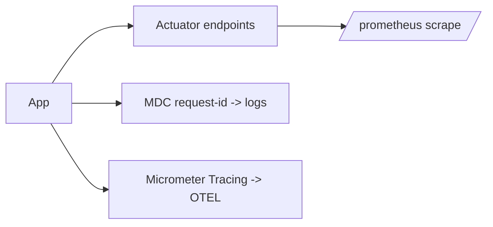

# Module 09 — Observability

> **Agent**: `@Memory.md` + `@Prompt.md` + this + `@NOTES.md` · ← [08](../08-testing/MODULE.md) · Next → [10 Deploy](../10-deploy-capstone/MODULE.md)

## Visual map
```
Actuator: /actuator/health, /metrics, /info, /prometheus
Micrometer: metrics facade -> Prometheus registry ; @Timed, Counter
MDC: put requestId in logging context (Logback) -> every log line tagged
Micrometer Tracing -> OTEL spans
```

**Mental model**: **Actuator** = production endpoints free (health/metrics/info). **Micrometer** = vendor-neutral metrics → Prometheus (CV: tumhara Prometheus). MDC = request-id in every log line. Liveness vs readiness for k8s.

**Redraw**: Actuator + Micrometer + MDC.

## Objectives
1. Actuator endpoints
2. Micrometer → Prometheus
3. MDC structured logging
4. liveness/readiness; OTEL

## Topics
- Spring Boot Actuator (`/health`,`/metrics`,`/prometheus`)
- Micrometer (`@Timed`, counters, custom metrics)
- Logback + MDC request-id; Micrometer Tracing → OTEL
- health groups (liveness/readiness)

## Assignments
| # | Task | Passing criteria |
|---|------|------------------|
| A1 | Actuator + Prometheus metrics + counter | `/prometheus` exposes metric |
| A2 | MDC request-id in logs | Each log has rid |

## Active recall
1. Actuator kya free deta?
2. Micrometer ka role?
3. liveness vs readiness?

## Checklist
- [ ] Observability from memory · [ ] A1,A2 · [ ] NOTES updated
