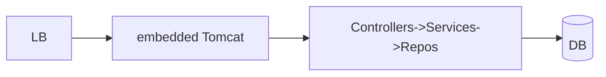

# Module 10 — Deploy & Capstone 🔥

> **Agent**: `@Memory.md` + `@Prompt.md` + this + `@NOTES.md` · ← [09](../09-observability/MODULE.md)

## Visual map
```
mvn package -> fat JAR (app + embedded Tomcat)
Docker: multi-stage (build JDK -> run JRE-slim) OR jib/buildpacks ; layered jars for cache
JVM: -Xmx heap, GC choice ; graceful shutdown (server.shutdown=graceful)
```

**Mental model**: Fat JAR = app + embedded server (self-contained). Multi-stage Docker (JRE slim) ya jib. Layered jars = better cache. JVM tuning (heap/GC). Capstone = enterprise-style service touching all modules.

**Redraw**: JAR → embedded Tomcat → layered app.

## Objectives
1. fat JAR + Docker
2. layered jars; profiles
3. JVM tuning basics; graceful shutdown
4. Capstone

## Topics
- `mvn package` fat JAR; multi-stage Docker / jib / buildpacks; layered jars
- env config + profiles; JVM heap/GC basics; `server.shutdown=graceful`
- **Capstone**: an order/payment or task/workflow API — controllers + DTOs + JPA + security + transactions + resilience + Actuator + tests + Docker

## Assignments
| # | Task | Passing criteria |
|---|------|------------------|
| A1 | Multi-stage Docker for the JAR | Image builds + runs, health ok |
| A2 | Capstone service all-modules | Defendable, README + numbers |

## Active recall
1. fat JAR kya contain karta?
2. layered jars ka faayda?
3. graceful shutdown kaise?

## Checklist
- [ ] Deploy from memory · [ ] A1,A2 · [ ] **Spring spaced-rep checklist** full pass · [ ] NOTES updated
