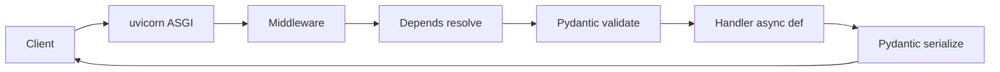

# FastAPI (Python) — Home

> Backend framework vault. ← [[Backend/README|Backend Index]] · related: [[AI/AI Development/modules/00c-fastapi/MODULE|AI vault's FastAPI primer]]

## Quick links
| Doc | Kya hai |
|-----|---------|
| [[Backend/Python-FastAPI/Memory\|Memory]] | Coach rules, profile, CV→FastAPI hooks |
| [[Backend/Python-FastAPI/Prompt\|Prompt]] | Hinglish coach persona |
| [[Backend/Python-FastAPI/LEARNING-PLAN\|LEARNING-PLAN]] | **Full syllabus** |
| [[Backend/Python-FastAPI/VISUAL-STUDY-GUIDE\|VISUAL-STUDY-GUIDE]] | Request lifecycle + spaced-rep |

## Why FastAPI for you
AI/LLM services (RAG, agents, eval) ka standard — async-native, Pydantic typing (= tumhara Zod), auto OpenAI-style docs, SSE streaming. Project A & B isi pe ship honge.

## Modules
| # | Module | Notes | Focus |
|---|--------|-------|-------|
| 00 | [[Backend/Python-FastAPI/modules/00-foundations/MODULE\|Foundations]] | [[Backend/Python-FastAPI/modules/00-foundations/NOTES\|NOTES]] | ASGI, uvicorn, project layout |
| 01 | [[Backend/Python-FastAPI/modules/01-routing-handlers/MODULE\|Routing & Handlers]] | [[Backend/Python-FastAPI/modules/01-routing-handlers/NOTES\|NOTES]] | Path/query, routers, responses |
| 02 | [[Backend/Python-FastAPI/modules/02-validation-serialization/MODULE\|Validation & Serialization]] | [[Backend/Python-FastAPI/modules/02-validation-serialization/NOTES\|NOTES]] | Pydantic models |
| 03 | [[Backend/Python-FastAPI/modules/03-middleware/MODULE\|Middleware & Depends]] | [[Backend/Python-FastAPI/modules/03-middleware/NOTES\|NOTES]] | Dependency injection, middleware |
| 04 | [[Backend/Python-FastAPI/modules/04-database-orm/MODULE\|Database & ORM]] | [[Backend/Python-FastAPI/modules/04-database-orm/NOTES\|NOTES]] | SQLAlchemy/SQLModel, Alembic |
| 05 | [[Backend/Python-FastAPI/modules/05-auth-security/MODULE\|Auth & Security]] | [[Backend/Python-FastAPI/modules/05-auth-security/NOTES\|NOTES]] | OAuth2, JWT |
| 06 | [[Backend/Python-FastAPI/modules/06-concurrency-async/MODULE\|Concurrency & Async]] 🔥 | [[Backend/Python-FastAPI/modules/06-concurrency-async/NOTES\|NOTES]] | asyncio, SSE, background |
| 07 | [[Backend/Python-FastAPI/modules/07-error-handling-resilience/MODULE\|Errors & Resilience]] | [[Backend/Python-FastAPI/modules/07-error-handling-resilience/NOTES\|NOTES]] | Exception handlers, timeouts |
| 08 | [[Backend/Python-FastAPI/modules/08-testing/MODULE\|Testing]] | [[Backend/Python-FastAPI/modules/08-testing/NOTES\|NOTES]] | TestClient, pytest |
| 09 | [[Backend/Python-FastAPI/modules/09-observability/MODULE\|Observability]] | [[Backend/Python-FastAPI/modules/09-observability/NOTES\|NOTES]] | OTEL, Prometheus |
| 10 | [[Backend/Python-FastAPI/modules/10-deploy-capstone/MODULE\|Deploy & Capstone]] 🔥 | [[Backend/Python-FastAPI/modules/10-deploy-capstone/NOTES\|NOTES]] | Docker, gunicorn, ship API |

## Request lifecycle (the mental model)


## Vault path
```
/Users/vansh/Desktop/Code/Learning/Backend/Python-FastAPI
```
