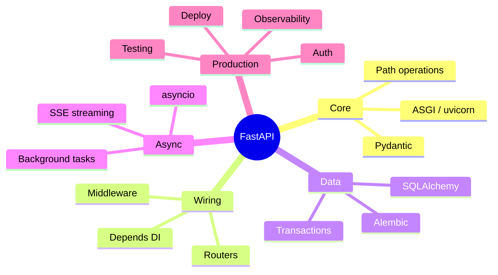

# FastAPI — Learning Plan (Full Syllabus)

> Visual learner: har module `## Visual map`. Start: `@VISUAL-STUDY-GUIDE.md`. No standard topic left out.

## Mind map

---

## Module 00 — Foundations
**Topics**: WSGI vs ASGI (why async); uvicorn/gunicorn; `pip`/`uv`/venv; project layout (`app/`, routers, models, services, deps); `FastAPI()` app; first `@app.get`; auto docs (`/docs` Swagger, `/redoc`, OpenAPI schema); hot reload.
**Assignments**: A1 hello-world API + read its OpenAPI schema; A2 structure a multi-file project.
**Exit**: WSGI vs ASGI; why uvicorn; project layout; OpenAPI auto-gen kaise.

## Module 01 — Routing & Handlers
**Topics**: Path operations (GET/POST/PUT/PATCH/DELETE); path & query params (typed); request body; `status_code`, `response_model`; `APIRouter` + `include_router` + prefixes/tags; path operation order; `Response`/`JSONResponse`/`RedirectResponse`.
**Assignments**: A1 CRUD routes for a resource with `response_model`; A2 split into routers.
**Exit**: path vs query vs body; `response_model` kya filter karta; routers kab.

## Module 02 — Validation & Serialization (Pydantic)
**Topics**: Pydantic v2 `BaseModel`; field types, defaults, `Field` constraints; validators (`field_validator`, `model_validator`); request vs response models (input/output split); nested models; `Optional`/unions; aliases; `ConfigDict`; serialization (`model_dump`); settings via `BaseSettings`.
**Assignments**: A1 input/output model pair with constraints + custom validator; A2 `BaseSettings` for env config.
**Exit**: Pydantic (= Zod) mental model; why separate request/response models; validator vs constraint.

## Module 03 — Middleware & Dependency Injection
**Topics**: `Depends()` (the killer feature); dependency functions, sub-dependencies, caching, `yield` deps (setup/teardown — DB session); `@app.middleware("http")`; CORS, GZip, TrustedHost middleware; dependency overrides (for tests); class deps; security deps preview.
**Assignments**: A1 a `get_db` yield-dependency; A2 a request-logging middleware + a CORS setup.
**Exit**: Depends vs middleware — kab kya; yield dependency lifecycle; dependency caching.

## Module 04 — Database & ORM
**Topics**: SQLAlchemy 2.0 (sync vs **async** engine), SQLModel option; sessions + the session-per-request dependency; models + relationships; CRUD; transactions + rollback; **Alembic** migrations; connection pooling; N+1 + eager loading; repository pattern.
**Assignments**: A1 async SQLAlchemy session dep + CRUD; A2 Alembic migration; A3 a transaction that rolls back on failure (CV: ledger).
**Exit**: async session per request; migration workflow; pooling; avoid N+1.

## Module 05 — Auth & Security
**Topics**: `OAuth2PasswordBearer`; JWT (create/verify, `python-jose`); password hashing (`passlib`/bcrypt); current-user dependency; scopes/roles (RBAC); refresh tokens; CORS/security headers; secrets handling; rate limiting (slowapi/Redis) preview.
**Assignments**: A1 login → JWT → protected route via `Depends(get_current_user)`; A2 role-scoped route.
**Exit**: OAuth2 password flow; JWT verify in a dependency; hashing why; RBAC.

## Module 06 — Concurrency & Async 🔥
**Topics**: `async def` vs `def` (threadpool offload); the event loop; **blocking-in-async trap** (don't call sync I/O in async without `run_in_threadpool`); `httpx.AsyncClient`; `asyncio.gather` for fan-out; **SSE streaming** (`StreamingResponse` — token-by-token, CV: Redis pub-sub); WebSockets; `BackgroundTasks` vs a real queue; concurrency limits.
**Assignments**: A1 async route calling 3 upstreams with `gather`; A2 SSE endpoint streaming chunks; A3 show + fix a blocking-in-async bug.
**Exit**: async vs sync handler; the blocking trap + fix; SSE streaming; gather fan-out.

## Module 07 — Error Handling & Resilience
**Topics**: `HTTPException`; custom exception handlers (`@app.exception_handler`); validation error shape; consistent error envelope; timeouts (`httpx` timeout, `asyncio.wait_for`); retries + backoff; circuit breaker (concept, CV); graceful shutdown (lifespan); idempotency keys.
**Assignments**: A1 global exception handler + error envelope; A2 upstream call with timeout + retry.
**Exit**: HTTPException vs custom handler; timeout/retry/breaker; idempotency.

## Module 08 — Testing
**Topics**: `TestClient`/`httpx.AsyncClient` for async; pytest fixtures; dependency overrides (mock DB/auth); test DB (transactional rollback per test); parametrize; testing validation + error paths; coverage.
**Assignments**: A1 test CRUD with overridden DB dependency; A2 test an auth-protected route (happy + 401).
**Exit**: dependency override in tests; async test client; transactional test DB.

## Module 09 — Observability
**Topics**: Structured logging (correlation/request IDs via middleware); OpenTelemetry (traces, spans, context propagation); `prometheus-fastapi-instrumentator` (RED metrics); health/readiness endpoints; logging cost/latency per request (CV: per-LLM-request tracing).
**Assignments**: A1 request-ID middleware + structured logs; A2 expose `/metrics` + a custom counter.
**Exit**: metrics vs logs vs traces in FastAPI; request-ID propagation; 4 golden signals here.

## Module 10 — Deploy & Capstone 🔥
**Topics**: gunicorn + uvicorn workers; Dockerfile (multi-stage, slim); env config; healthchecks; graceful shutdown; perf (workers vs async, profiling, `--loop uvloop`); **Capstone**: ship a real service end-to-end (suggest: a mini LLM-gateway or a RAG ingest API) with auth + DB + SSE + tests + metrics + Docker.
**Assignments**: A1 Dockerize + run with gunicorn; A2 capstone service hitting all modules.
**Exit**: workers model; Docker for FastAPI; a defendable shipped service.

---

## Weekly rhythm
Mon–Tue concept+recall · Wed–Thu build assignment · Fri resilience/observability polish + NOTES · Sat spaced recall · Sun capstone.

## Spaced repetition checklist (har 2 modules)
- [ ] Request lifecycle (uvicorn→mw→deps→validate→handler→serialize)
- [ ] Depends vs middleware
- [ ] async vs def handler + blocking trap
- [ ] yield dependency (DB session) lifecycle
- [ ] SSE streaming flow
- [ ] response_model vs request model
