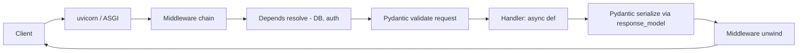

# FastAPI Visual Study Guide — Vansh

> Diagrams pehle, redraw se recall.

## Request lifecycle (MEMORIZE)


## async vs def (the #1 trap)
```
@app.get  async def  -> runs ON the event loop  -> use ONLY async I/O (httpx, async db)
@app.get  def        -> offloaded to a THREADPOOL -> ok to do sync/blocking I/O

TRAP: sync/blocking call (requests.get, time.sleep, sync db) inside `async def`
      => blocks the WHOLE event loop => throughput tanks.
FIX:  use async client, or await run_in_threadpool(blocking_fn)
```

## Depends (dependency injection)
```
def get_db():            # yield dependency = setup/teardown
    db = Session()
    try: yield db        # injected into handler
    finally: db.close()  # always runs after response

@app.get("/x")
def handler(db = Depends(get_db), user = Depends(get_current_user)): ...
# sub-deps resolve + cache within a request; great for DB, auth, settings
```

## SSE streaming (CV: Redis pub-sub → WS)
```
async def gen():
    async for chunk in llm_stream():
        yield f"data: {chunk}\n\n"
return StreamingResponse(gen(), media_type="text/event-stream")
```

## Node ↔ FastAPI bridge
```
Express app.get      -> @app.get
Zod schema           -> Pydantic BaseModel
middleware           -> @app.middleware / Depends
Prisma               -> SQLAlchemy / SQLModel
async/await (libuv)  -> async/await (asyncio event loop)
```

## Spaced-rep recall bank
1. WSGI vs ASGI?
2. async def vs def — kahan run hota?
3. Blocking-in-async trap + fix?
4. yield dependency lifecycle?
5. response_model kya karta?
6. SSE streaming kaise?
