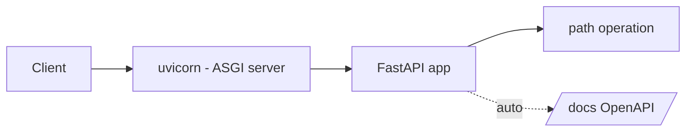

# Module 00 — FastAPI Foundations

> **Agent**: `@Memory.md` + `@Prompt.md` + this + `@NOTES.md` · Next → [01 Routing](../01-routing-handlers/MODULE.md)

## Visual map

```
WSGI (sync, 1 req/worker/time)   vs   ASGI (async, many concurrent)
project: app/ {main.py, routers/, models/, services/, deps.py, db.py}
```
**Mental model**: FastAPI = ASGI app; uvicorn event loop par chalता hai → ek worker thousands concurrent I/O handle karta. Type hints se auto-validation + auto OpenAPI docs free milte hain.

**Redraw**: client→uvicorn→app→handler + /docs.

## Objectives
1. WSGI vs ASGI (why async)
2. uvicorn/gunicorn; venv/uv
3. Project layout
4. Auto OpenAPI docs

## Topics
- WSGI vs ASGI; uvicorn vs gunicorn
- venv / `uv` / pip; `FastAPI()` app; first `@app.get`
- `/docs` (Swagger), `/redoc`, `openapi.json`; `--reload`
- Multi-file project structure

## Assignments
| # | Task | Passing criteria |
|---|------|------------------|
| A1 | Hello-world API + inspect `/openapi.json` | Runs on uvicorn, docs render |
| A2 | Structure a multi-file app (routers/, deps.py) | Clean import graph, runs |

## Active recall
1. WSGI vs ASGI?
2. uvicorn vs gunicorn — roles?
3. OpenAPI docs auto kaise bante?

## Checklist
- [ ] Lifecycle diagram from memory · [ ] A1,A2 · [ ] NOTES updated
