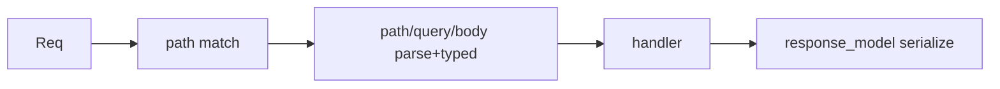

# Module 01 — Routing & Handlers

> **Agent**: `@Memory.md` + `@Prompt.md` + this + `@NOTES.md` · ← [00](../00-foundations/MODULE.md) · Next → [02 Validation](../02-validation-serialization/MODULE.md)

## Visual map
```
GET /items/{id}?q=foo
       │ path param      │ query param
@app.get("/items/{id}", response_model=ItemOut, status_code=200)
def read(id: int, q: str | None = None): ...

APIRouter(prefix="/users", tags=["users"]) -> include_router(app)
```

**Mental model**: Path operation = method + path + handler. Params typed se auto-parse + validate. `response_model` output ka contract (extra fields filter). Routers = modular grouping (= Express Router).

**Redraw**: request → match → parse → handler → response_model.

## Objectives
1. Methods, path/query/body params (typed)
2. `response_model`, `status_code`
3. `APIRouter` + include + prefix/tags
4. Response types

## Topics
- GET/POST/PUT/PATCH/DELETE; path vs query vs body
- `response_model` (filtering, docs); `status_code`
- `APIRouter`, `include_router`, prefixes, tags; route order
- `JSONResponse`/`RedirectResponse`/`Response`

## Assignments
| # | Task | Passing criteria |
|---|------|------------------|
| A1 | CRUD for a resource with `response_model` | All verbs work, output shaped |
| A2 | Split into an APIRouter with prefix/tags | Same behavior, modular |

## Active recall
1. path vs query vs body — kab kaunsa?
2. `response_model` kya filter/document karta?
3. Router kab use karoge?

## Checklist
- [ ] Routing diagram from memory · [ ] A1,A2 · [ ] NOTES updated
