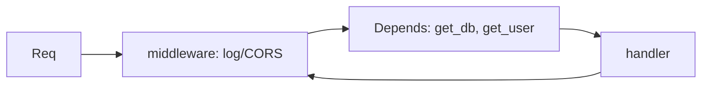

# Module 03 — Middleware & Dependency Injection

> **Agent**: `@Memory.md` + `@Prompt.md` + this + `@NOTES.md` · ← [02](../02-validation-serialization/MODULE.md) · Next → [04 DB](../04-database-orm/MODULE.md)

## Visual map

```
def get_db():            Depends graph (per-request, cached):
    db = Session()         handler <- get_current_user <- get_token
    try: yield db                 <- get_db
    finally: db.close()   yield dep: setup before, teardown after response
```
**Mental model**: **Depends** = FastAPI ka DI — reusable wiring (DB session, auth, settings) inject karo, testable + DRY. Middleware = har request pe cross-cutting (logging, CORS, timing). Depends = per-route + typed; middleware = global + raw.

**Redraw**: middleware wrap + Depends resolution tree.

## Objectives
1. `Depends`, sub-deps, caching
2. `yield` deps (setup/teardown)
3. HTTP middleware; CORS/GZip
4. Dependency overrides (tests)

## Topics
- `Depends()`; dependency functions; sub-dependencies; caching within request
- `yield` dependencies (DB session lifecycle)
- `@app.middleware("http")`; CORS, GZip, TrustedHost
- `app.dependency_overrides` (testing); class-based deps

## Assignments
| # | Task | Passing criteria |
|---|------|------------------|
| A1 | `get_db` yield-dependency | Session opens/closes per request |
| A2 | Request-logging middleware + CORS | Logs each req; CORS works |

## Active recall
1. Depends vs middleware — kab kya?
2. yield dependency lifecycle?
3. Dependency caching kya bachata?

## Checklist
- [ ] Depends tree from memory · [ ] A1,A2 · [ ] NOTES updated
