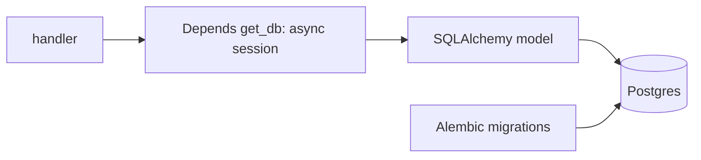

# Module 04 — Database & ORM

> **Agent**: `@Memory.md` + `@Prompt.md` + this + `@NOTES.md` · ← [03](../03-middleware/MODULE.md) · Next → [05 Auth](../05-auth-security/MODULE.md)

## Visual map

```
async engine -> async_sessionmaker -> session per request (yield dep)
txn: async with session.begin(): ...  (commit/rollback)
N+1: lazy load in loop -> use selectinload / join
```
**Mental model**: Session-per-request (yield dep). Async engine = non-blocking DB I/O (event loop friendly). Alembic = versioned migrations (= Prisma migrate). Transaction = atomic (CV: ledger rollback).

**Redraw**: handler→get_db→model→Postgres + Alembic.

## Objectives
1. SQLAlchemy 2.0 async (or SQLModel)
2. Session-per-request dep; relationships
3. Transactions + rollback
4. Alembic; pooling; N+1

## Topics
- Sync vs async engine; `async_sessionmaker`; session dependency
- Models, relationships, CRUD; `selectinload` (N+1 fix)
- Transactions (`begin()`), rollback on error
- Alembic migrations; connection pool sizing; repository pattern

## Assignments
| # | Task | Passing criteria |
|---|------|------------------|
| A1 | Async session dep + CRUD for a model | Persists + reads correctly |
| A2 | Alembic migration (create table) | `alembic upgrade head` works |
| A3 | Transaction that rolls back on failure | No partial write (CV: ledger) |

## Active recall
1. Session-per-request kyun (not global)?
2. async engine ka faayda?
3. N+1 kya, fix?

## Checklist
- [ ] DB flow from memory · [ ] A1–A3 · [ ] NOTES updated
