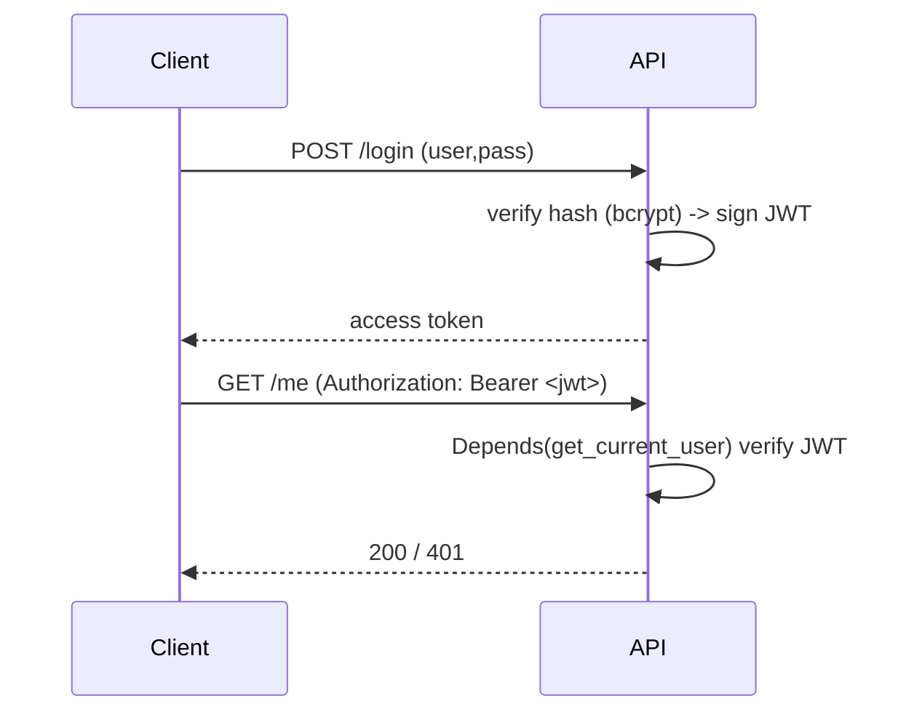

# Module 05 — Auth & Security

> **Agent**: `@Memory.md` + `@Prompt.md` + this + `@NOTES.md` · ← [04](../04-database-orm/MODULE.md) · Next → [06 Async](../06-concurrency-async/MODULE.md)

## Visual map

**Mental model**: Login → password hash verify → signed JWT. Protected route = `Depends(get_current_user)` jo JWT verify karta. RBAC = scopes/roles check dependency mein. Hash store karo, plaintext kabhi nahi.

**Redraw**: login→JWT→protected route sequence.

## Objectives
1. `OAuth2PasswordBearer` flow
2. JWT create/verify; password hashing
3. current-user dependency
4. Scopes/roles (RBAC); refresh tokens

## Topics
- `OAuth2PasswordBearer`; `/token` endpoint
- JWT (`python-jose`): claims, exp, verify; `passlib`/bcrypt hashing
- `get_current_user` dependency; 401/403
- Scopes/RBAC; refresh tokens; security headers; rate limiting preview

## Assignments
| # | Task | Passing criteria |
|---|------|------------------|
| A1 | login → JWT → protected route | Valid token 200, missing/bad 401 |
| A2 | Role-scoped route | Wrong role → 403 |

## Active recall
1. OAuth2 password flow steps?
2. JWT verify kahan (dependency)?
3. Hash kyun (not encrypt/plaintext)?

## Checklist
- [ ] Auth sequence from memory · [ ] A1,A2 · [ ] NOTES updated
