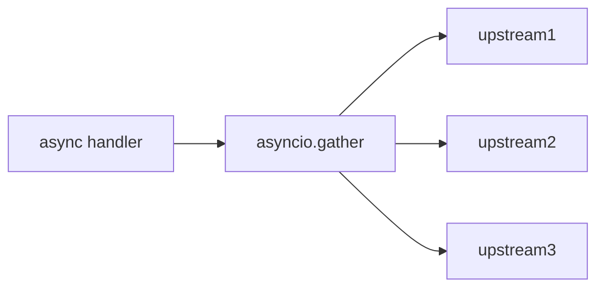

# Module 06 — Concurrency & Async 🔥

> **Agent**: `@Memory.md` + `@Prompt.md` + this + `@NOTES.md` · ← [05](../05-auth-security/MODULE.md) · Next → [07 Resilience](../07-error-handling-resilience/MODULE.md)

## Visual map
```
@app.get async def  -> event loop  -> ONLY async I/O (httpx, async db)
@app.get def        -> threadpool  -> ok for sync/blocking

TRAP: requests.get / time.sleep / sync-db inside async def => blocks event loop => dead throughput
FIX:  httpx.AsyncClient  |  await run_in_threadpool(blocking_fn)

fan-out: results = await asyncio.gather(call1(), call2(), call3())
SSE:    StreamingResponse(gen(), media_type="text/event-stream")
```

**Mental model**: Event loop single-thread, concurrency I/O-await pe milti. Blocking call loop ko freeze kar deta — sabse bada FastAPI bug. SSE = token-by-token stream (CV: Redis pub-sub → WS). `gather` = parallel fan-out.

**Redraw**: async-vs-def routing + the blocking trap.

## Objectives
1. async def vs def (threadpool)
2. blocking-in-async trap + fix
3. `gather` fan-out; `httpx.AsyncClient`
4. SSE streaming; BackgroundTasks

## Topics
- Event loop; `async def` vs `def` offload
- Blocking trap; `run_in_threadpool`; async clients
- `asyncio.gather`; concurrency limits/semaphores
- `StreamingResponse` SSE; WebSockets; `BackgroundTasks` vs real queue

## Assignments
| # | Task | Passing criteria |
|---|------|------------------|
| A1 | Async route calling 3 upstreams via `gather` | Concurrent, faster than serial |
| A2 | SSE endpoint streaming chunks | Client receives incrementally |
| A3 | Reproduce + fix a blocking-in-async bug | Throughput restored, explained |

## Active recall
1. async def vs def — kahan run?
2. Blocking trap + 2 fixes?
3. SSE flow?

## Checklist
- [ ] async routing + trap from memory · [ ] A1–A3 · [ ] NOTES updated
