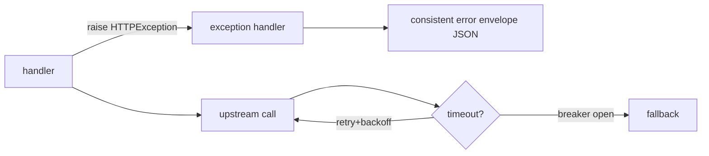

# Module 07 — Error Handling & Resilience

> **Agent**: `@Memory.md` + `@Prompt.md` + this + `@NOTES.md` · ← [06](../06-concurrency-async/MODULE.md) · Next → [08 Testing](../08-testing/MODULE.md)

## Visual map

**Mental model**: Predictable errors = `HTTPException`; global shape via `@app.exception_handler`. Upstream calls hamesha timeout + retry(+backoff) + breaker se wrap karo (CV: provider fallback cascade). Idempotency key = safe retries.

**Redraw**: error envelope + timeout/retry/breaker.

## Objectives
1. `HTTPException`, custom handlers, error envelope
2. Timeouts, retries+backoff
3. Circuit breaker (concept)
4. Graceful shutdown (lifespan); idempotency

## Topics
- `HTTPException`; `@app.exception_handler`; validation error shape; consistent envelope
- `httpx` timeout, `asyncio.wait_for`; retry + exponential backoff + jitter
- Circuit breaker; graceful shutdown via `lifespan`; idempotency keys

## Assignments
| # | Task | Passing criteria |
|---|------|------------------|
| A1 | Global exception handler + error envelope | All errors same JSON shape |
| A2 | Upstream call with timeout + retry | Times out + retries, then fails clean |

## Active recall
1. HTTPException vs custom handler?
2. timeout/retry/breaker — kaunsa kab?
3. Idempotency key kyun?

## Checklist
- [ ] Resilience diagram from memory · [ ] A1,A2 · [ ] NOTES updated
