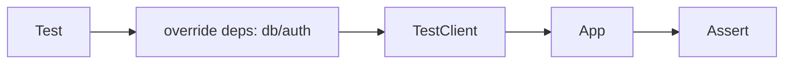

# Module 08 — Testing

> **Agent**: `@Memory.md` + `@Prompt.md` + this + `@NOTES.md` · ← [07](../07-error-handling-resilience/MODULE.md) · Next → [09 Observability](../09-observability/MODULE.md)

## Visual map
```
app.dependency_overrides[get_db] = test_db   # swap real deps for tests
client = TestClient(app)  /  httpx.AsyncClient(app=app)  # async
test DB: transaction per test -> rollback after (clean state)
```

**Mental model**: `dependency_overrides` = test ka superpower — real DB/auth ko mock se swap karo bina code chhede. Async routes ke liye async client. Test DB transaction-per-test rollback se isolation.

**Redraw**: override → client → app → assert.

## Objectives
1. `TestClient` / async client
2. Dependency overrides (mock db/auth)
3. Transactional test DB
4. Testing validation + error paths

## Topics
- `TestClient`; `httpx.AsyncClient` for async; pytest fixtures
- `app.dependency_overrides`; mock DB/auth
- Test DB with rollback per test; `parametrize`
- Testing 422/401/500 paths; coverage

## Assignments
| # | Task | Passing criteria |
|---|------|------------------|
| A1 | Test CRUD with overridden DB dep | Tests pass, isolated |
| A2 | Test auth route (200 + 401) | Both paths asserted |

## Active recall
1. dependency_overrides kya enable karta?
2. async route test kaise?
3. Test isolation (rollback) kaise?

## Checklist
- [ ] Override flow from memory · [ ] A1,A2 · [ ] NOTES updated
