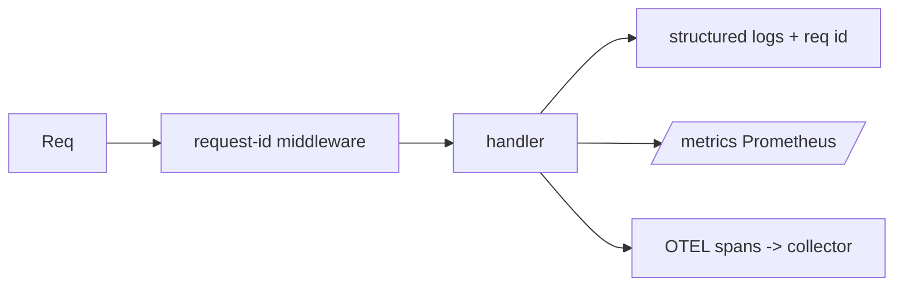

# Module 09 — Observability

> **Agent**: `@Memory.md` + `@Prompt.md` + this + `@NOTES.md` · ← [08](../08-testing/MODULE.md) · Next → [10 Deploy](../10-deploy-capstone/MODULE.md)

## Visual map

```
Metrics (RED: Rate, Errors, Duration) | Logs (events + req id) | Traces (span tree)
4 golden signals: Latency, Traffic, Errors, Saturation
```
**Mental model**: 3 pillars — metrics (aggregate), logs (events), traces (per-request path). Request-ID middleware se ek request ko logs+traces mein jodo. CV: tumne Prometheus p99 kiya — yahi, per-request cost/latency.

**Redraw**: req-id middleware + 3 pillars.

## Objectives
1. Structured logging + request IDs
2. OpenTelemetry traces/spans
3. Prometheus metrics
4. Health/readiness

## Topics
- Structured logs; correlation/request-ID middleware
- OTEL: spans, context propagation, exporters
- `prometheus-fastapi-instrumentator`; custom counters/histograms
- `/health` `/ready`; per-request cost/latency logging

## Assignments
| # | Task | Passing criteria |
|---|------|------------------|
| A1 | Request-ID middleware + structured logs | Each log carries request id |
| A2 | `/metrics` + a custom counter | Counter increments per route |

## Active recall
1. metrics vs logs vs traces?
2. Request-ID propagate kyun?
3. 4 golden signals?

## Checklist
- [ ] 3 pillars from memory · [ ] A1,A2 · [ ] NOTES updated
