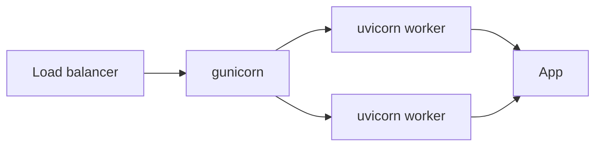

# Module 10 — Deploy & Capstone 🔥

> **Agent**: `@Memory.md` + `@Prompt.md` + this + `@NOTES.md` · ← [09](../09-observability/MODULE.md)

## Visual map
```
gunicorn -k uvicorn.workers.UvicornWorker -w 4 app.main:app
  N workers (processes) × async event loop each = many concurrent conns
Dockerfile: multi-stage (build deps -> slim runtime), non-root, healthcheck
```

**Mental model**: Process-level scale = gunicorn workers; each worker async = I/O concurrency. Docker multi-stage = chhoti image. Capstone = sab modules ek real service mein (auth + DB + SSE + tests + metrics + Docker).

**Redraw**: LB → gunicorn → workers.

## Objectives
1. gunicorn + uvicorn workers
2. Dockerfile (multi-stage)
3. Perf (workers vs async, uvloop)
4. Capstone service

## Topics
- gunicorn worker model; `--workers`; graceful shutdown
- Dockerfile multi-stage, slim, non-root, healthcheck; env config
- Perf: workers vs async, profiling, `uvloop`
- **Capstone**: ship a mini LLM-gateway OR RAG-ingest API (auth + DB + SSE + resilience + tests + metrics + Docker)

## Assignments
| # | Task | Passing criteria |
|---|------|------------------|
| A1 | Dockerize + run with gunicorn | Image builds, serves, healthcheck ok |
| A2 | Capstone service touching all modules | Defendable end-to-end, README + numbers |

## Active recall
1. workers vs async — dono kyun?
2. Multi-stage Docker ka faayda?
3. Graceful shutdown kyun?

## Checklist
- [ ] Worker model from memory · [ ] A1,A2 · [ ] **FastAPI spaced-rep checklist** full pass · [ ] NOTES updated
