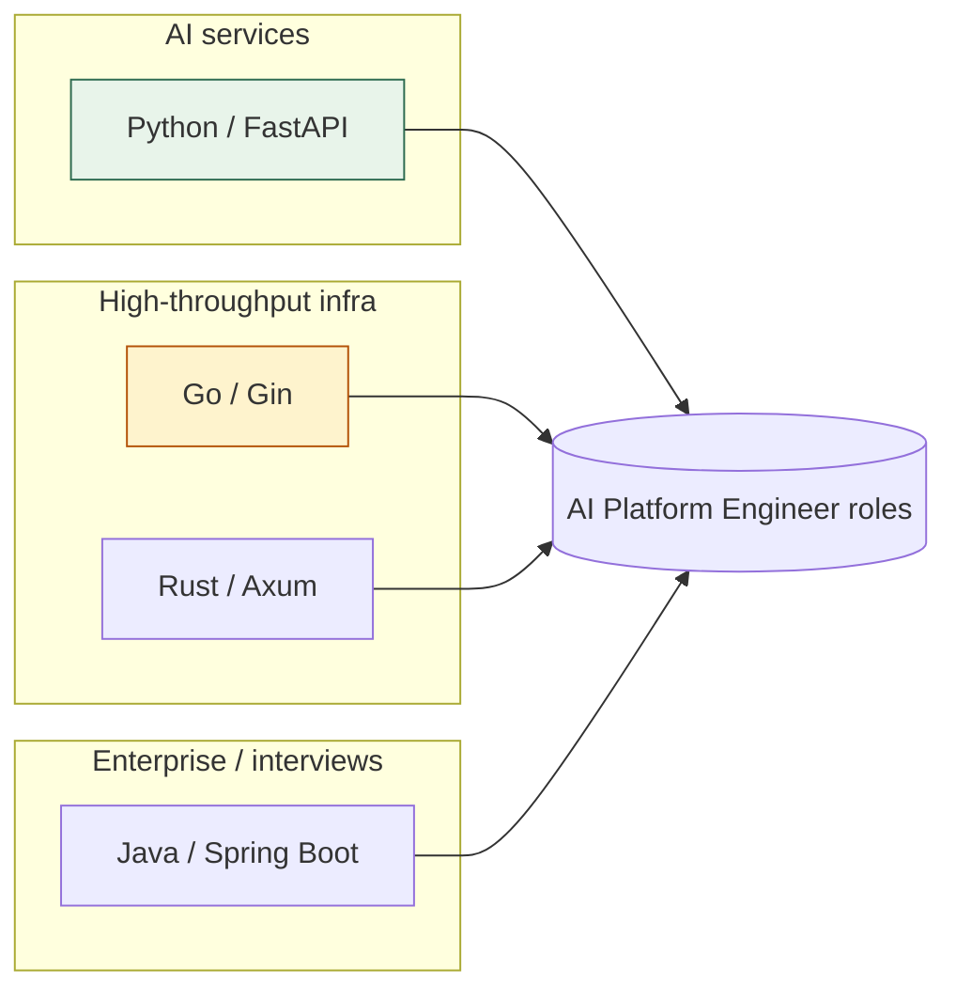

# 🖥️ Backend Frameworks — Master Index

> Polyglot backend mastery for **AI-infra / platform engineer** roles (OpenAI · Anthropic · MAANG · YC). Same visual-first, Hinglish, struggle-first DNA as the rest of this repo. ← [[INTERVIEW-PREP|CS Master Index]]

## The 4 frameworks (best = most relevant to your goals)

| Language | Framework | Folder | Sweet spot for you |
|----------|-----------|--------|--------------------|
| **Python** | **FastAPI** | [[Backend/Python-FastAPI/Home\|FastAPI]] | AI/LLM services, RAG, agents (Pydantic + async) |
| **Go** | **Gin** | [[Backend/Go-Gin/Home\|Gin]] | LLM Gateway, high-throughput proxies, infra (goroutines) |
| **Rust** | **Axum** | [[Backend/Rust-Axum/Home\|Axum]] | Perf-critical services, safe concurrency (Tokio) |
| **Java** | **Spring Boot** | [[Backend/Java-SpringBoot/Home\|Spring Boot]] | Enterprise/MAANG interviews, large services |

## Your polyglot thesis (from AI Projects.md)
> "Right tool per workload" — **Go** for perf infra (LLM Gateway), **Python/FastAPI** for AI services (RAG/agents/eval), **Node/TS** for realtime. This backend track makes that defendable. Add **Rust** for the highest-perf path and **Java** for the broadest interview surface.

## Same 11-module path in every framework
Concepts are universal; only the idioms change. Learn the shape once, re-apply per language.

| # | Module | What |
|---|--------|------|
| 00 | Foundations | lang refresher, setup, hello-world, project layout |
| 01 | Routing & handlers | routes, params, responses |
| 02 | Validation & serialization | typed request/response models |
| 03 | Middleware | cross-cutting (logging, auth, CORS, rate limit) |
| 04 | Database & ORM | data access, migrations, transactions |
| 05 | Auth & security | JWT/OAuth, password hashing, RBAC |
| 06 | Concurrency & async | the framework's concurrency model 🔥 (most differentiated) |
| 07 | Error handling & resilience | timeouts, retries, circuit breaker |
| 08 | Testing | unit + integration + API tests |
| 09 | Observability | logging, metrics, tracing (OTEL/Prometheus) |
| 10 | Deploy & capstone | Docker, build, perf + ship a real service |

## How to use (visual learner)
1. Pick a framework Home → read MODULE → **visual map first**
2. Coach: `@Backend/<fw>/Memory.md @Backend/<fw>/Prompt.md @Backend/<fw>/modules/XX/MODULE.md` (or just the `learning-coach` skill)
3. Build incrementally — coach gives stubs + passing criteria, **tu code likhta hai**
4. Session end: redraw the request-lifecycle diagram → `NOTES.md`

## Suggested order
**FastAPI** (fastest to ship + your AI work) → **Go/Gin** (your gateway) → **Spring Boot** (interview surface) → **Rust/Axum** (perf depth). Concepts transfer, so each next one is faster.

## Cross-framework cheat sheet
| Concern | FastAPI | Gin | Axum | Spring Boot |
|---------|---------|-----|------|-------------|
| Validation | Pydantic | struct tags + binding | serde + extractors | Bean Validation |
| ORM/data | SQLAlchemy / SQLModel | GORM / sqlx | sqlx / SeaORM | Spring Data JPA |
| Concurrency | async/await (asyncio) | goroutines + channels | async/await (Tokio) | threads / virtual threads / WebFlux |
| Auth | OAuth2 + JWT deps | middleware + JWT | tower middleware + JWT | Spring Security |
| DI | Depends() | manual / wire | manual / state | Spring IoC container |
