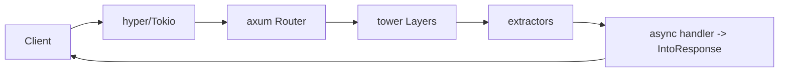

# Rust (Axum) — Home

> Backend framework vault. ← [[Backend/README|Backend Index]] · use case: perf-critical, safe-concurrency services

## Quick links
| Doc | Kya hai |
|-----|---------|
| [[Backend/Rust-Axum/Memory\|Memory]] | Coach rules, profile, CV→Rust hooks |
| [[Backend/Rust-Axum/Prompt\|Prompt]] | Hinglish coach persona |
| [[Backend/Rust-Axum/LEARNING-PLAN\|LEARNING-PLAN]] | **Full syllabus** |
| [[Backend/Rust-Axum/VISUAL-STUDY-GUIDE\|VISUAL-STUDY-GUIDE]] | Ownership + async + spaced-rep |

## Why Rust/Axum for you
Highest-perf path with **memory safety + fearless concurrency** (no GC pauses). Axum = Tokio team ka modern framework (tower middleware, type-safe extractors). For the parts of infra jahan Go bhi kam pade. Hardest language — par sabse strong signal.

## Modules
| # | Module | Notes | Focus |
|---|--------|-------|-------|
| 00 | [[Backend/Rust-Axum/modules/00-foundations/MODULE\|Foundations]] | [[Backend/Rust-Axum/modules/00-foundations/NOTES\|NOTES]] | ownership, Result, cargo, Tokio |
| 01 | [[Backend/Rust-Axum/modules/01-routing-handlers/MODULE\|Routing & Handlers]] | [[Backend/Rust-Axum/modules/01-routing-handlers/NOTES\|NOTES]] | Router, extractors |
| 02 | [[Backend/Rust-Axum/modules/02-validation-serialization/MODULE\|Serde & Validation]] | [[Backend/Rust-Axum/modules/02-validation-serialization/NOTES\|NOTES]] | serde, validator |
| 03 | [[Backend/Rust-Axum/modules/03-middleware/MODULE\|Middleware & State]] | [[Backend/Rust-Axum/modules/03-middleware/NOTES\|NOTES]] | tower layers, State |
| 04 | [[Backend/Rust-Axum/modules/04-database-orm/MODULE\|Database (sqlx/SeaORM)]] | [[Backend/Rust-Axum/modules/04-database-orm/NOTES\|NOTES]] | sqlx, migrations |
| 05 | [[Backend/Rust-Axum/modules/05-auth-security/MODULE\|Auth & Security]] | [[Backend/Rust-Axum/modules/05-auth-security/NOTES\|NOTES]] | JWT extractor |
| 06 | [[Backend/Rust-Axum/modules/06-concurrency-async/MODULE\|Async & Tokio]] 🔥 | [[Backend/Rust-Axum/modules/06-concurrency-async/NOTES\|NOTES]] | async/await, tasks, channels |
| 07 | [[Backend/Rust-Axum/modules/07-error-handling-resilience/MODULE\|Errors & Resilience]] | [[Backend/Rust-Axum/modules/07-error-handling-resilience/NOTES\|NOTES]] | Result, ?, IntoResponse |
| 08 | [[Backend/Rust-Axum/modules/08-testing/MODULE\|Testing]] | [[Backend/Rust-Axum/modules/08-testing/NOTES\|NOTES]] | tower::ServiceExt, oneshot |
| 09 | [[Backend/Rust-Axum/modules/09-observability/MODULE\|Observability]] | [[Backend/Rust-Axum/modules/09-observability/NOTES\|NOTES]] | tracing, OTEL, Prometheus |
| 10 | [[Backend/Rust-Axum/modules/10-deploy-capstone/MODULE\|Deploy & Capstone]] 🔥 | [[Backend/Rust-Axum/modules/10-deploy-capstone/NOTES\|NOTES]] | Docker, release, perf service |

## Request flow (mental model)


## Vault path
```
/Users/vansh/Desktop/Code/Learning/Backend/Rust-Axum
```
