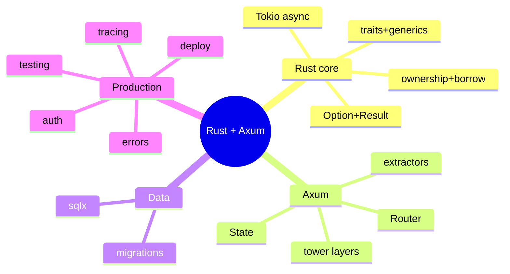

# Rust (Axum) — Learning Plan (Full Syllabus)

> Visual learner: har module `## Visual map`. Start: `@VISUAL-STUDY-GUIDE.md`. No standard topic left out.

## Mind map

---

## Module 00 — Foundations
**Topics**: cargo + crates; types, structs, enums, pattern matching (`match`); **ownership, move, borrow (`&`/`&mut`), lifetimes**; `Option<T>`/`Result<T,E>` + `?`; **traits** (interfaces) + generics; `Vec`/`HashMap`/`String` vs `&str`; `Box`/`Rc`/`Arc`; the Tokio runtime (`#[tokio::main]`); first Axum hello.
**Assignments**: A1 a function that borrows vs one that moves (read the errors); A2 an enum + `match` + `Option`/`Result` with `?`.
**Exit**: ownership/move/borrow; Option vs Result + `?`; traits; why Tokio.

## Module 01 — Routing & Handlers
**Topics**: `Router::new().route("/x", get(handler))`; **extractors** (`Path`, `Query`, `Json`, `State`, `Extension`) — type-safe request parts; handler return types implementing `IntoResponse`; status codes; nested routers + merge; `axum::serve`.
**Assignments**: A1 CRUD routes with `Path`/`Json` extractors; A2 nest a sub-router.
**Exit**: extractors (how Axum injects typed parts); `IntoResponse`; nesting.

## Module 02 — Serde & Validation
**Topics**: `serde` (`#[derive(Serialize, Deserialize)]`); `Json<T>` extractor (auto-deserialize → 400 on bad); separate request/response structs; the `validator` crate (`#[validate(...)]`); custom validation; enums in JSON; `Option` for optional fields.
**Assignments**: A1 request/response structs with serde + validator; A2 custom validator + clean 400.
**Exit**: serde derive; Json extractor validation; request/response split.

## Module 03 — Middleware & State
**Topics**: **tower** `Service`/`Layer` model (Axum is tower-based); `tower-http` (Trace, Cors, Compression, Timeout); custom middleware (`from_fn`); **shared state** via `State(Arc<AppState>)`; `Extension`; request-scoped data; layer ordering.
**Assignments**: A1 add Trace + Cors + Timeout layers; A2 `State(Arc<AppState>)` with a DB pool + a custom request-id middleware.
**Exit**: tower Layer model; State vs Extension; sharing state with `Arc`.

## Module 04 — Database (sqlx / SeaORM)
**Topics**: **sqlx** (async, **compile-time checked queries** via `query!`), or SeaORM; `PgPool` in `State`; CRUD; transactions (`pool.begin()`); migrations (`sqlx migrate`); mapping rows to structs (`FromRow`); connection pool sizing; passing the pool through State.
**Assignments**: A1 sqlx CRUD with a `PgPool` in State; A2 migration + a transaction that rolls back.
**Exit**: sqlx compile-checked queries; pool in State; txn rollback.

## Module 05 — Auth & Security
**Topics**: `jsonwebtoken` (encode/decode); a custom **extractor** `AuthUser` that verifies the Bearer JWT (`FromRequestParts`); password hashing (`argon2`/`bcrypt`); RBAC via claims; CORS; rate limiting (tower-governor); secrets via env (`dotenvy`).
**Assignments**: A1 `AuthUser` extractor verifying JWT → protected handler; A2 role check.
**Exit**: custom extractor for auth; argon2 hashing; RBAC.

## Module 06 — Async & Tokio 🔥
**Topics**: `async`/`.await`; the Tokio runtime + tasks (`tokio::spawn`); **the cardinal sin: holding a `std::Mutex` across `.await`** (use `tokio::sync::Mutex` or don't hold); channels (`mpsc`, `oneshot`, `broadcast`); `tokio::select!`; `join!`/`try_join!` for fan-out; cancellation (drop a future) + `CancellationToken`; `Arc<Mutex<T>>` vs message-passing for shared state (CV: matching engine); `Send + Sync` bounds; backpressure with bounded channels.
**Assignments**: A1 fan-out 3 upstreams with `try_join!` + a timeout; A2 a bounded `mpsc` worker; A3 fix a "future is not Send" / lock-across-await error.
**Exit**: async/await + tasks; lock-across-await trap; channels + select; Arc<Mutex> vs channels.

## Module 07 — Error Handling & Resilience
**Topics**: `Result<T,E>` + `?`; custom error enum + `thiserror`; `anyhow` for app errors; implementing **`IntoResponse` for your error** (errors → HTTP responses); `?` in handlers; timeouts (`tokio::time::timeout`, tower Timeout layer); retries + backoff; circuit breaker; graceful shutdown (`axum::serve(...).with_graceful_shutdown`).
**Assignments**: A1 an `AppError` enum implementing `IntoResponse`; A2 upstream call with `timeout` + retry.
**Exit**: error enum + IntoResponse; `?` propagation; timeout/retry; graceful shutdown.

## Module 08 — Testing
**Topics**: `#[tokio::test]`; testing handlers via `tower::ServiceExt::oneshot` (drive the Router without a real server); building requests; asserting status/body; a test DB (sqlx + transaction rollback); mocking via traits; integration tests in `tests/`.
**Assignments**: A1 handler test with `oneshot`; A2 test an auth-protected route (200 + 401).
**Exit**: `oneshot` testing; tokio::test; test DB.

## Module 09 — Observability
**Topics**: the `tracing` crate (structured spans/events, `#[instrument]`); `tower-http::TraceLayer`; OTEL via `tracing-opentelemetry`; Prometheus (`metrics` + `metrics-exporter-prometheus`); request-id; health endpoints; per-request latency.
**Assignments**: A1 `tracing` + TraceLayer + request-id; A2 Prometheus `/metrics` + a counter.
**Exit**: tracing spans; TraceLayer; metrics exporter.

## Module 10 — Deploy & Capstone 🔥
**Topics**: `cargo build --release` (optimized); minimal Docker (multi-stage, distroless/scratch with musl static); env config; graceful shutdown; perf (release profile, `tokio` worker threads, flamegraph); **Capstone**: a perf-critical service (suggest: a high-throughput rate-limiter/proxy or an embeddings-cache service) with State+pool, auth, sqlx, tracing, graceful shutdown, Docker.
**Assignments**: A1 release Docker (multi-stage); A2 capstone service touching all modules.
**Exit**: release build + tiny image; a defendable high-perf service.

---

## Weekly rhythm
Mon–Tue ownership/concept+recall · Wed–Thu build (fight borrow checker) · Fri async/errors + NOTES · Sat spaced recall · Sun capstone.

## Spaced repetition checklist (har 2 modules) — Rust needs MORE reps
- [ ] ownership: move vs borrow (`&` vs `&mut`)
- [ ] Option vs Result + `?`
- [ ] traits vs generics
- [ ] lock-across-`.await` trap
- [ ] extractors + IntoResponse
- [ ] Arc<Mutex> vs channels
- [ ] error enum → IntoResponse
