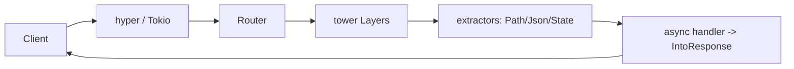

# Rust (Axum) Visual Study Guide — Vansh

> Diagrams pehle, redraw se recall. Rust = zyada reps chahiye.

## Ownership & borrowing (THE core)
```
let s = String::from("hi");   // s OWNS the heap string
let s2 = s;                   // MOVE: s2 owns it now, s is invalid (use -> compile error)
fn take(s: String){}         // moves in
fn borrow(s: &String){}      // shared borrow (many &T allowed)
fn edit(s: &mut String){}    // exclusive borrow (only one &mut, no other refs)

RULE: at any time -> many &T  XOR  one &mut T.  Compiler => no data races, no GC.
~ C++ RAII + move, but enforced at compile time.
```

## Axum request flow


## Extractors + IntoResponse
```
async fn create(State(db): State<Arc<AppState>>, Json(body): Json<CreateItem>)
    -> Result<Json<ItemOut>, AppError> { ... }
// Axum injects typed parts (State, Json) ; handler returns anything : IntoResponse
// errors: impl IntoResponse for AppError -> maps to (StatusCode, Json)
```

## Async pitfall (the #1 Rust-async bug)
```
// BAD: holding a std::Mutex guard across .await -> can deadlock / !Send
let g = mutex.lock().unwrap();
something().await;            // <-- guard still held across await  ✗
// FIX: drop guard before await, or use tokio::sync::Mutex, or message-pass via channel
```

## Shared state: Arc<Mutex> vs channels
```
Arc<Mutex<T>>      : shared mutable state, lock to touch (simple, contention risk)
mpsc channel + task: one owner task, others send messages (actor style; CV: matching engine)
```

## C++/Go ↔ Rust bridge
```
C++ RAII/move     -> ownership + move
C++ unique_ptr    -> Box<T>     | shared_ptr -> Arc<T>
try/catch         -> Result<T,E> + ?
interface         -> trait
Go goroutine+chan -> tokio::spawn + mpsc
```

## Spaced-rep recall bank
1. move vs borrow vs &mut?
2. Option vs Result, `?` kya karta?
3. lock-across-await kyun bug?
4. extractor kya hai?
5. Arc<Mutex> vs channel — kab?
6. trait vs generic?
