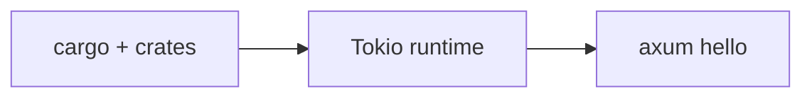

# Module 00 — Rust + Axum Foundations

> **Agent**: `@Memory.md` + `@Prompt.md` + this + `@NOTES.md` · Next → [01 Routing](../01-routing-handlers/MODULE.md)

## Visual map
```
let s = String::from("hi");  // OWNS
let s2 = s;                  // MOVE (s invalid now)
fn borrow(x: &T)            // shared ref (many)   |  fn edit(x: &mut T)  // exclusive (one)
Option<T> = Some/None       |  Result<T,E> = Ok/Err   |  ?  propagates Err
trait = interface           |  #[tokio::main] async fn main()  // runtime
```

**Mental model**: Rust ka core = ownership (ek owner, move/borrow, lifetime). Null/exceptions nahi — `Option`/`Result` + `?`. Traits = interfaces. C++ RAII se transfer hoga. Borrow checker se ladai normal.

**Redraw**: move vs borrow + Option/Result.

## Objectives
1. Ownership, move, borrow, lifetimes
2. Option/Result + `?`
3. Traits + generics
4. Tokio runtime; cargo

## Topics
- cargo/crates; structs, enums, `match`
- ownership, move, `&`/`&mut`, lifetimes
- `Option`/`Result`, `?`; `String` vs `&str`; `Box`/`Rc`/`Arc`
- traits + generics; `#[tokio::main]`; first Axum

## Assignments
| # | Task | Passing criteria |
|---|------|------------------|
| A1 | A borrow fn vs a move fn (read errors) | Understand the compile errors |
| A2 | enum + match + Option/Result with `?` | Compiles, handles None/Err |

## Active recall
1. move vs borrow?
2. Option vs Result?
3. trait kya?

## Checklist
- [ ] Ownership from memory · [ ] A1,A2 · [ ] NOTES updated
