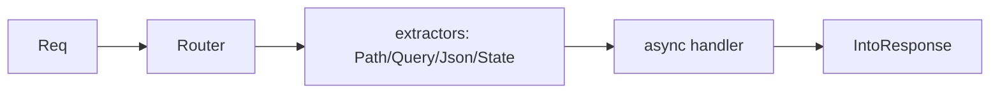

# Module 01 — Routing & Handlers

> **Agent**: `@Memory.md` + `@Prompt.md` + this + `@NOTES.md` · ← [00](../00-foundations/MODULE.md) · Next → [02 Serde](../02-validation-serialization/MODULE.md)

## Visual map
```
let app = Router::new()
    .route("/items/:id", get(read))
    .route("/items", post(create));
async fn read(Path(id): Path<u32>, Query(q): Query<Params>) -> impl IntoResponse { ... }
// extractors = Axum injects typed request parts (Path, Query, Json, State)
// return type : IntoResponse  (tuple, Json, StatusCode, Result...)
```

**Mental model**: Router routes ko handlers se map karta. **Extractors** = type-safe request parsing (Axum function signature dekh ke inject karta). Handler return koi bhi `IntoResponse` ho.

**Redraw**: router → extractors → handler → IntoResponse.

## Objectives
1. `Router` + `route` + method fns
2. Extractors (Path/Query/Json/State)
3. `IntoResponse`
4. Nesting/merge

## Topics
- `Router::new().route("/x", get(h))`; method routing
- extractors: `Path`, `Query`, `Json`, `State`, `Extension`
- handler return `impl IntoResponse`; status codes
- nested routers, `merge`; `axum::serve`

## Assignments
| # | Task | Passing criteria |
|---|------|------------------|
| A1 | CRUD with `Path`/`Json` extractors | All verbs respond |
| A2 | Nest a sub-router | Namespaced routes |

## Active recall
1. Extractor kya, kaise inject hota?
2. IntoResponse kya allow karta?
3. Path vs Query extractor?

## Checklist
- [ ] Extractor flow from memory · [ ] A1,A2 · [ ] NOTES updated
