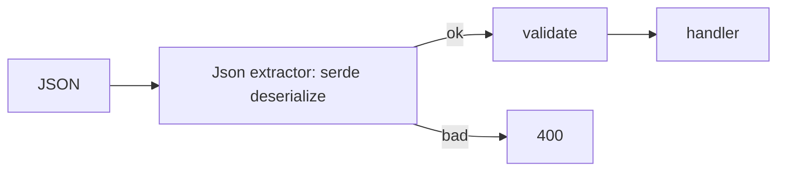

# Module 02 — Serde & Validation

> **Agent**: `@Memory.md` + `@Prompt.md` + this + `@NOTES.md` · ← [01](../01-routing-handlers/MODULE.md) · Next → [03 Middleware](../03-middleware/MODULE.md)

## Visual map
```
#[derive(Deserialize, Validate)]
struct CreateItem { #[validate(length(min=1))] name: String,
                    #[validate(range(min=1.0))] price: f64 }
async fn create(Json(body): Json<CreateItem>) -> ...
// Json extractor auto-deserializes; bad JSON -> 400 ; then body.validate()? for rules
```

**Mental model**: serde derive = (de)serialization (= Zod/Pydantic). `Json<T>` extractor auto-deserialize + 400 on bad shape. `validator` crate business rules. Request/response structs alag.

**Redraw**: JSON → serde → validate → handler / 400.

## Objectives
1. serde derive
2. `Json<T>` extractor
3. validator crate
4. request/response split

## Topics
- `#[derive(Serialize, Deserialize)]`; enums in JSON; `Option` fields
- `Json<T>` extractor; deserialize errors → 400
- `validator` `#[validate(...)]`; custom validation
- separate request/response structs

## Assignments
| # | Task | Passing criteria |
|---|------|------------------|
| A1 | serde + validator request/response | Bad input → 400 |
| A2 | Custom validator | Enforces rule |

## Active recall
1. serde derive kya deta?
2. Json extractor bad shape pe?
3. request/response alag kyun?

## Checklist
- [ ] serde flow from memory · [ ] A1,A2 · [ ] NOTES updated
