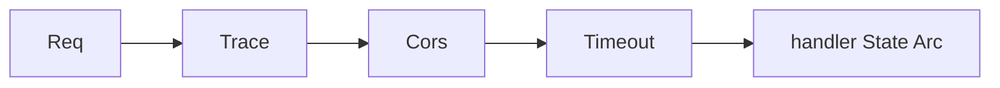

# Module 03 — Middleware & State

> **Agent**: `@Memory.md` + `@Prompt.md` + this + `@NOTES.md` · ← [02](../02-validation-serialization/MODULE.md) · Next → [04 DB](../04-database-orm/MODULE.md)

## Visual map
```
let state = Arc::new(AppState { pool, ... });
let app = Router::new()
    .route(...)
    .layer(TraceLayer::new_for_http())   // tower layer
    .layer(CorsLayer::permissive())
    .with_state(state);                  // State(Arc<AppState>) injected into handlers
```

**Mental model**: Axum tower pe — middleware = `Layer`. `tower-http` ready-made (Trace, Cors, Timeout, Compression). Shared state = `Arc<AppState>` (DB pool etc.) via `with_state` → `State` extractor. Layer order matters.

**Redraw**: layer stack + State(Arc).

## Objectives
1. tower `Layer`/`Service`
2. `tower-http` layers
3. custom middleware (`from_fn`)
4. shared State via `Arc`

## Topics
- tower model; `.layer()`; ordering
- `tower-http`: Trace, Cors, Timeout, Compression
- `middleware::from_fn`; request-id
- `with_state(Arc<AppState>)`; `State` vs `Extension`

## Assignments
| # | Task | Passing criteria |
|---|------|------------------|
| A1 | Add Trace + Cors + Timeout layers | All active |
| A2 | `State(Arc<AppState>)` w/ pool + request-id middleware | State injected, rid set |

## Active recall
1. tower Layer kya?
2. State vs Extension?
3. State share kaise (Arc)?

## Checklist
- [ ] Layer + State from memory · [ ] A1,A2 · [ ] NOTES updated
