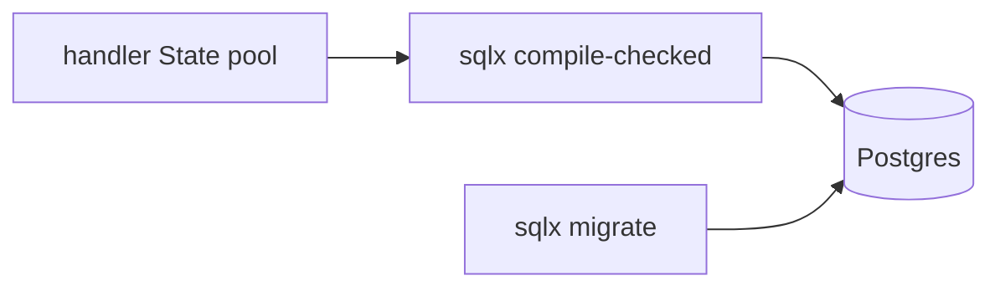

# Module 04 — Database (sqlx / SeaORM)

> **Agent**: `@Memory.md` + `@Prompt.md` + this + `@NOTES.md` · ← [03](../03-middleware/MODULE.md) · Next → [05 Auth](../05-auth-security/MODULE.md)

## Visual map
```
let pool = PgPool::connect(&url).await?;     // in AppState (Arc)
let row = sqlx::query_as!(Item, "SELECT * FROM items WHERE id=$1", id)
    .fetch_one(&pool).await?;                // query! = COMPILE-TIME checked SQL
let mut tx = pool.begin().await?; ...; tx.commit().await?;  // or drop = rollback
```

**Mental model**: sqlx = async + **compile-time SQL verification** (galat query = build fail — Rust ka killer feature). `PgPool` State mein. Txn: begin → commit, ya drop pe rollback. SeaORM = ORM alternative.

**Redraw**: handler→sqlx→Postgres + migrate.

## Objectives
1. sqlx compile-checked queries
2. `PgPool` in State
3. transactions + migrations
4. row → struct (`FromRow`)

## Topics
- sqlx async; `query!`/`query_as!` compile-time check; SeaORM option
- `PgPool` via State; pool sizing
- `pool.begin()` txn, commit/rollback
- `sqlx migrate`; `FromRow`

## Assignments
| # | Task | Passing criteria |
|---|------|------------------|
| A1 | sqlx CRUD with PgPool in State | Persists + reads |
| A2 | Migration + rolling-back txn | No partial write |

## Active recall
1. sqlx compile-checked query ka faayda?
2. pool State mein kyun (Arc)?
3. txn rollback kaise?

## Checklist
- [ ] DB flow from memory · [ ] A1,A2 · [ ] NOTES updated
