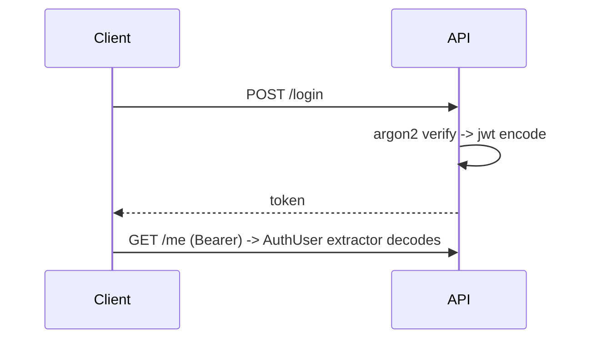

# Module 05 — Auth & Security

> **Agent**: `@Memory.md` + `@Prompt.md` + this + `@NOTES.md` · ← [04](../04-database-orm/MODULE.md) · Next → [06 Async](../06-concurrency-async/MODULE.md)

## Visual map
```
struct AuthUser { id: i64, role: String }
impl FromRequestParts<S> for AuthUser {     // a custom EXTRACTOR
    async fn from_request_parts(...) -> Result<Self, AppError> {
        // read Authorization: Bearer -> jsonwebtoken::decode -> claims -> AuthUser
    }
}
async fn me(user: AuthUser) -> ... {}        // just add it to the signature = protected
```

**Mental model**: Auth = custom **extractor** (`FromRequestParts`) jo JWT verify karke `AuthUser` deta — handler signature mein add karo = protected (type-safe). argon2 hashing. RBAC = role claim.

**Redraw**: AuthUser extractor + login sequence.

## Objectives
1. jsonwebtoken encode/decode
2. custom `AuthUser` extractor
3. argon2 hashing; RBAC
4. rate limiting

## Topics
- `jsonwebtoken`; claims/exp
- `FromRequestParts` extractor for auth; 401/403
- argon2/bcrypt; RBAC via claims
- CORS; tower-governor rate limit; `dotenvy` secrets

## Assignments
| # | Task | Passing criteria |
|---|------|------------------|
| A1 | `AuthUser` extractor → protected handler | Valid 200, bad 401 |
| A2 | Role check | Wrong role 403 |

## Active recall
1. Auth extractor (FromRequestParts) ka faayda?
2. argon2 kyun?
3. RBAC kahan se (claims)?

## Checklist
- [ ] Auth extractor from memory · [ ] A1,A2 · [ ] NOTES updated
