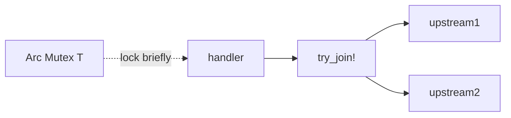

# Module 06 — Async & Tokio 🔥

> **Agent**: `@Memory.md` + `@Prompt.md` + this + `@NOTES.md` · ← [05](../05-auth-security/MODULE.md) · Next → [07 Resilience](../07-error-handling-resilience/MODULE.md)

## Visual map
```
tokio::spawn(async move { ... });        // task (like a goroutine)
let (r1, r2) = tokio::try_join!(a(), b());  // fan-out, first-error
let (tx, mut rx) = mpsc::channel(100);   // bounded = backpressure
tokio::select! { v = rx.recv() => ..., _ = token.cancelled() => return }

CARDINAL SIN: hold std::Mutex guard across .await  => deadlock / !Send
FIX: drop guard before await | tokio::sync::Mutex | message-pass
```

**Mental model**: async/await Tokio runtime pe; `spawn` = task. Shared state: `Arc<Mutex<T>>` (lock briefly, NEVER across `.await`) ya channels (actor — CV: matching engine). Bounded channel = backpressure. `Send + Sync` bounds samjho.

**Redraw**: try_join fan-out + lock-across-await trap.

## Objectives
1. async/await + tasks
2. lock-across-`.await` trap
3. channels (mpsc/oneshot/broadcast) + select
4. Arc<Mutex> vs channels; backpressure

## Topics
- `async`/`.await`; `tokio::spawn`; `join!`/`try_join!`
- **lock across await** trap; `tokio::sync::Mutex`
- channels; `tokio::select!`; cancellation (`CancellationToken`)
- `Arc<Mutex<T>>` vs message-passing; `Send + Sync`; bounded backpressure

## Assignments
| # | Task | Passing criteria |
|---|------|------------------|
| A1 | Fan-out 3 upstreams `try_join!` + timeout | Concurrent, cancels on timeout |
| A2 | Bounded `mpsc` worker | Backpressure works |
| A3 | Fix a "not Send"/lock-across-await error | Compiles, explained |

## Active recall
1. lock-across-await kyun bug?
2. Arc<Mutex> vs channel — kab?
3. bounded channel kya deta?

## Checklist
- [ ] async + trap from memory · [ ] A1–A3 · [ ] NOTES updated
