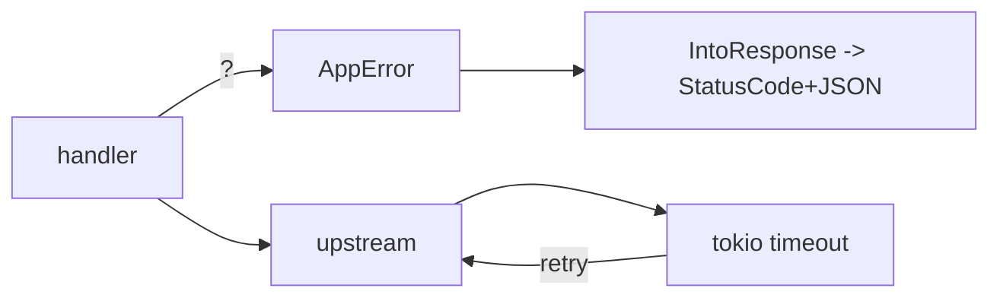

# Module 07 — Error Handling & Resilience

> **Agent**: `@Memory.md` + `@Prompt.md` + this + `@NOTES.md` · ← [06](../06-concurrency-async/MODULE.md) · Next → [08 Testing](../08-testing/MODULE.md)

## Visual map
```
#[derive(thiserror::Error)]
enum AppError { #[error("not found")] NotFound, #[error(transparent)] Db(#[from] sqlx::Error) }
impl IntoResponse for AppError { fn into_response(self) -> Response { /* map -> (StatusCode, Json) */ } }
async fn h(...) -> Result<Json<T>, AppError> { let x = repo().await?; Ok(Json(x)) }  // ? propagates
```

**Mental model**: Errors = `Result` + custom `AppError` enum (`thiserror`). Implement `IntoResponse` for it → handler `?` se error auto HTTP response banta (clean + type-safe). Upstream: `tokio::time::timeout` + retry; graceful shutdown.

**Redraw**: AppError → IntoResponse + timeout/retry.

## Objectives
1. error enum + `thiserror`
2. `IntoResponse` for errors + `?`
3. timeouts, retries
4. graceful shutdown

## Topics
- `Result`+`?`; `thiserror` enum; `#[from]`; `anyhow` for app code
- `impl IntoResponse for AppError`
- `tokio::time::timeout`, tower Timeout; retry+backoff; circuit breaker
- `with_graceful_shutdown`

## Assignments
| # | Task | Passing criteria |
|---|------|------------------|
| A1 | `AppError` enum + IntoResponse | Errors → proper status+JSON |
| A2 | Upstream w/ timeout + retry | Times out, retries clean |

## Active recall
1. IntoResponse for error ka faayda?
2. `?` handler mein kya karta?
3. graceful shutdown?

## Checklist
- [ ] Error→response from memory · [ ] A1,A2 · [ ] NOTES updated
