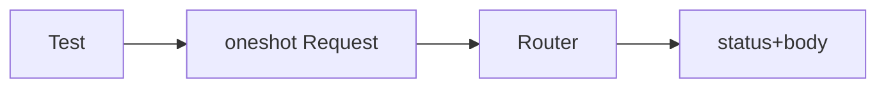

# Module 08 — Testing

> **Agent**: `@Memory.md` + `@Prompt.md` + this + `@NOTES.md` · ← [07](../07-error-handling-resilience/MODULE.md) · Next → [09 Observability](../09-observability/MODULE.md)

## Visual map
```
#[tokio::test]
async fn create_works() {
    let app = build_router(test_state());
    let res = app.oneshot(Request::builder().uri("/items").body(...)?).await?; // no real server
    assert_eq!(res.status(), StatusCode::OK);
}
// tower::ServiceExt::oneshot drives the Router directly; test DB via sqlx txn rollback
```

**Mental model**: `oneshot` (tower) se Router ko bina server chalaye test karo — ek request bhejo, response assert karo. `#[tokio::test]` async tests. Mock via traits. Test DB transaction rollback.

**Redraw**: oneshot → router → assert.

## Objectives
1. `#[tokio::test]`
2. `oneshot` handler testing
3. test DB
4. mocking via traits

## Topics
- `#[tokio::test]`; build router with test state
- `tower::ServiceExt::oneshot`; build `Request`; assert status/body
- test DB (sqlx txn rollback); trait mocking; `tests/` integration

## Assignments
| # | Task | Passing criteria |
|---|------|------------------|
| A1 | Handler test via `oneshot` | Passes |
| A2 | Auth route test (200 + 401) | Both paths |

## Active recall
1. oneshot kya karta?
2. tokio::test kyun?
3. test DB isolation kaise?

## Checklist
- [ ] oneshot from memory · [ ] A1,A2 · [ ] NOTES updated
