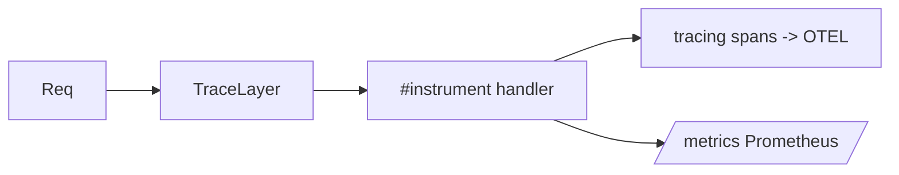

# Module 09 — Observability

> **Agent**: `@Memory.md` + `@Prompt.md` + this + `@NOTES.md` · ← [08](../08-testing/MODULE.md) · Next → [10 Deploy](../10-deploy-capstone/MODULE.md)

## Visual map
```
#[tracing::instrument]               // auto span around a fn
async fn handler(...) { tracing::info!(rid, "handling"); }
app.layer(TraceLayer::new_for_http())              // request spans
tracing-opentelemetry -> OTEL exporter
metrics-exporter-prometheus -> /metrics
```

**Mental model**: `tracing` = Rust ka structured logging + spans (`#[instrument]` auto-span). TraceLayer per-request spans. tracing-opentelemetry → OTEL. metrics-exporter-prometheus → `/metrics`. Per-request latency.

**Redraw**: TraceLayer + instrument + metrics.

## Objectives
1. `tracing` spans/events
2. TraceLayer
3. OTEL via tracing-opentelemetry
4. Prometheus metrics

## Topics
- `tracing`; `#[instrument]`; structured fields; request-id
- `tower-http::TraceLayer`
- `tracing-opentelemetry`; exporters
- `metrics` + `metrics-exporter-prometheus`; `/health`

## Assignments
| # | Task | Passing criteria |
|---|------|------------------|
| A1 | tracing + TraceLayer + request-id | Spans with rid |
| A2 | Prometheus `/metrics` + counter | Metrics emitted |

## Active recall
1. tracing vs plain logging?
2. #[instrument] kya karta?
3. TraceLayer ka role?

## Checklist
- [ ] tracing from memory · [ ] A1,A2 · [ ] NOTES updated
