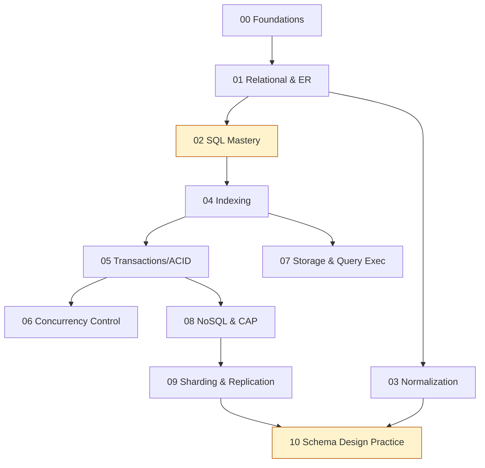

# Database (DBMS) — Home

> DB vault entry point. ← back to [[INTERVIEW-PREP|Master Index]]

## Quick links
| Doc | Kya hai |
|-----|---------|
| [[Database/Memory\|Memory]] | Coach rules, profile, CV→DB hooks |
| [[Database/Prompt\|Prompt]] | Hinglish coach persona |
| [[Database/LEARNING-PLAN\|LEARNING-PLAN]] | **Full syllabus** + SQL drills |
| [[Database/VISUAL-STUDY-GUIDE\|VISUAL-STUDY-GUIDE]] | Master diagrams + spaced-rep |

## Modules
| # | Syllabus | Notes | Focus |
|---|----------|-------|-------|
| 00 | [[Database/modules/00-foundations/MODULE\|Foundations]] | [[Database/modules/00-foundations/NOTES\|NOTES]] | DBMS, architecture, keys |
| 01 | [[Database/modules/01-relational-model-er/MODULE\|Relational Model & ER]] | [[Database/modules/01-relational-model-er/NOTES\|NOTES]] | ER → schema |
| 02 | [[Database/modules/02-sql-mastery/MODULE\|SQL Mastery]] 🔥 | [[Database/modules/02-sql-mastery/NOTES\|NOTES]] | Joins, windows, CTE |
| 03 | [[Database/modules/03-normalization/MODULE\|Normalization]] | [[Database/modules/03-normalization/NOTES\|NOTES]] | 1NF→BCNF, FDs |
| 04 | [[Database/modules/04-indexing/MODULE\|Indexing]] | [[Database/modules/04-indexing/NOTES\|NOTES]] | B+ tree, hash, covering |
| 05 | [[Database/modules/05-transactions-acid/MODULE\|Transactions & ACID]] | [[Database/modules/05-transactions-acid/NOTES\|NOTES]] | Isolation, MVCC |
| 06 | [[Database/modules/06-concurrency-control/MODULE\|Concurrency Control]] | [[Database/modules/06-concurrency-control/NOTES\|NOTES]] | 2PL, locks, deadlock |
| 07 | [[Database/modules/07-storage-query-execution/MODULE\|Storage & Query Execution]] | [[Database/modules/07-storage-query-execution/NOTES\|NOTES]] | EXPLAIN, join algos |
| 08 | [[Database/modules/08-nosql-cap/MODULE\|NoSQL & CAP]] | [[Database/modules/08-nosql-cap/NOTES\|NOTES]] | KV/doc/column/graph |
| 09 | [[Database/modules/09-sharding-replication/MODULE\|Sharding & Replication]] | [[Database/modules/09-sharding-replication/NOTES\|NOTES]] | Partitioning, replicas |
| 10 | [[Database/modules/10-schema-design-practice/MODULE\|Schema Design Practice]] 🔥 | [[Database/modules/10-schema-design-practice/NOTES\|NOTES]] | Design problems + SQL bank |

## Reading workflow
1. **Home** → MODULE kholo → **Visual map** (2 min)
2. Topics padho → diagram se map
3. Module 02 & 10 mein **SQL queries khud likho + run** (Postgres/SQLite)
4. Session end: Redraw challenge → `NOTES.md → My diagrams`
5. Coach: `@Memory.md @Prompt.md @modules/XX/MODULE.md`

## Dependency order


## Vault path
```
/Users/vansh/Desktop/Code/Learning/Database
```
